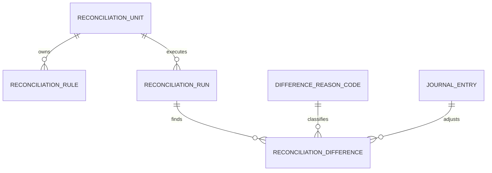
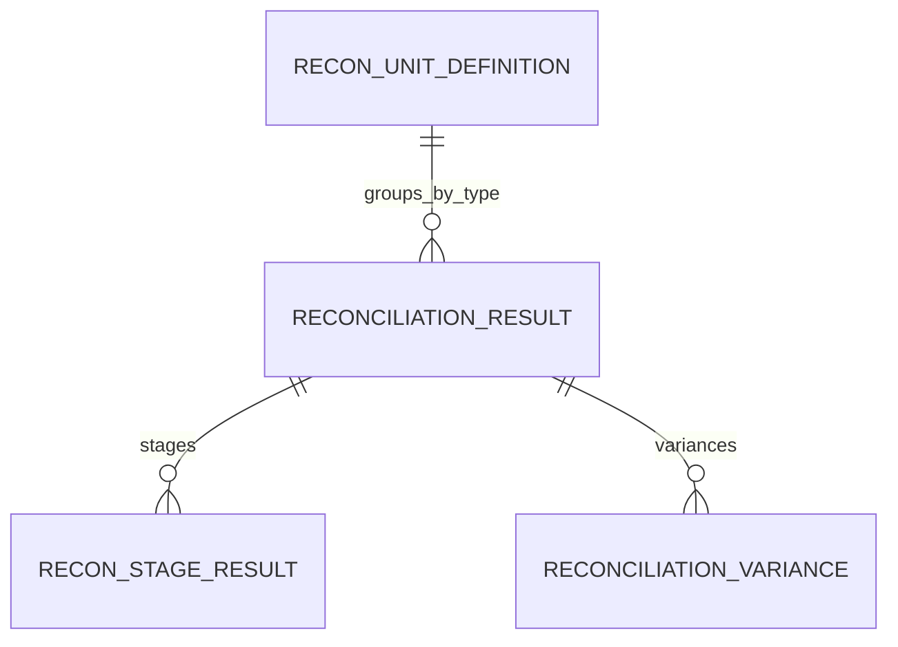

# Reconciliation Schema

## 1. 메인 대사 모델

### `reconciliation_units`

주요 컬럼:
- `id`
- `name`
- `description`
- `frequency`
- `reconciliation_type`
- `criteria_json`
- `is_active`
- `created_at`, `updated_at`, `audit_user`

의미:
- 어떤 업무 범위를 어떤 기준으로 대사할지 정의합니다.

### `reconciliation_rules`

주요 컬럼:
- `id`
- `reconciliation_unit_id`
- `name`
- `rule_definition_json`
- `tolerance_type`
- `tolerance_value`
- `priority`
- `is_active`
- `created_at`, `updated_at`, `audit_user`

의미:
- 자동 매칭 기준과 허용오차를 정의합니다.

### `reconciliation_runs`

주요 컬럼:
- `id`
- `reconciliation_unit_id`
- `reconciliation_date`
- `run_start_time`
- `run_end_time`
- `status`
- `total_items_source`
- `total_amount_source`
- `total_items_target`
- `total_amount_target`
- `matched_items_count`
- `matched_amount`
- `unmatched_items_count`
- `unmatched_amount`
- `run_by`
- `created_at`, `updated_at`, `audit_user`

의미:
- 실행 단위별 집계 결과와 상태를 보관합니다.

### `reconciliation_differences`

주요 컬럼:
- `id`
- `reconciliation_run_id`
- `difference_type`
- `amount_expected`
- `amount_actual`
- `difference_amount`
- `description`
- `source_item_ref`
- `target_item_ref`
- `reason_code_id`
- `adjustment_journal_entry_id`
- `status`
- `assigned_to_user`
- `sla_due_date`
- `resolved_at`
- `resolved_by`
- `created_at`, `updated_at`, `audit_user`

의미:
- 대사 과정에서 발견된 차이와 처리 상태를 저장합니다.

### `difference_reason_codes`

주요 컬럼:
- `id`
- `code`
- `name`
- `description`
- `is_adjustable`
- `is_active`
- `created_at`, `updated_at`, `audit_user`

의미:
- 차이 원인을 분류하고 조정분개 필요 여부를 결정합니다.

## 2. 심화 대사 모델

### `RECON_UNIT_DEFINITION`

주요 컬럼:
- `UNIT_ID`
- `UNIT_NAME`
- `RECON_TYPE`
- `PRODUCT_CODE`
- `CURRENCY_CODE`
- `LEGAL_ENTITY_CODE`
- `TOLERANCE_AMOUNT`
- `SLA_DAYS`
- `ASSIGNED_DEPT`
- `MATCHING_RULES_JSON`
- `IS_ACTIVE`
- `CREATE_DATE`, `UPDATE_DATE`, `AUDIT_USER`

의미:
- 심화 대사에서 쓰는 단위 정의입니다.
- `MATCHING_RULES_JSON`은 다음 실행 설정을 담을 수 있습니다.
  - `sourceAmount`, `sourceCount`
  - `interfaceAmount`, `interfaceCount`
  - `journalAccountCode`
  - `ledgerAccountCode`, `ledgerCurrencyCode`
  - `ledgerAmountBasis`: `DEBIT`, `CREDIT`, `ENDING_BALANCE`, `ABS_ENDING_BALANCE`

### `RECONCILIATION_RESULTS`

주요 컬럼:
- `RECONCILIATION_DATE`
- `RECONCILIATION_TYPE`
- `CLOSING_PERIOD_ID`
- `STATUS`
- `TOTAL_COUNT_SOURCE`
- `TOTAL_AMOUNT_SOURCE`
- `TOTAL_COUNT_TARGET`
- `TOTAL_AMOUNT_TARGET`
- `VARIANCE_COUNT`
- `VARIANCE_AMOUNT`
- `RUN_BY`
- `RUN_AT`

의미:
- 4단계 대사의 총괄 결과입니다.

### `RECON_STAGE_RESULT`

주요 컬럼:
- `RECON_RESULT_ID`
- `STAGE_CODE`
- `TOTAL_COUNT`
- `TOTAL_AMOUNT`
- `CREATE_DATE`
- `AUDIT_USER`

의미:
- `SOURCE`, `INTERFACE`, `JOURNAL`, `LEDGER` 단계별 집계 결과를 저장합니다.

## 3. 읽을 때 중요한 점

- 메인 API는 `ReconciliationUnit` 계열을 사용합니다.
- `ReconManagerService`는 별도 모델(`ReconUnitDefinition` 계열)을 사용합니다.
- 즉, 현재 스키마는 한 세트로 완전히 통합되어 있지 않습니다.
