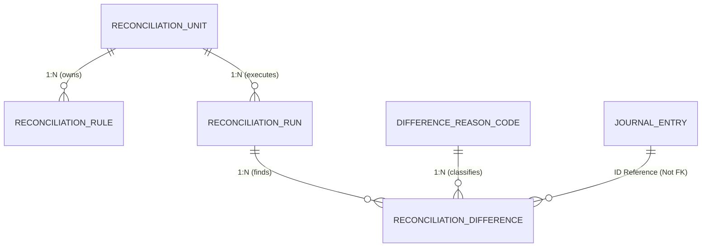

# Reconciliation Schema

## 1. 메인 대사 모델 및 JPA 엔티티 매핑

시스템은 헥사고날 아키텍처와 SCD2(Slowly Changing Dimensions) 사상을 반영하여, 주요 마스터 데이터의 변경 이력을 관리할 수 있는 구조를 지향합니다. 외부 모듈 연동은 ID-based Reference를 사용합니다.

### `reconciliation_units` (대사 단위)
- **특징:** SCD2를 적용하여 설정 변경 시 기존 레코드의 만료일시를 닫고 새 버전을 생성할 수 있는 구조를 지원합니다.
- `id` (PK)
- `name`, `description`
- `frequency`, `reconciliation_type`
- `criteria_json` (상세 비교 조건)
- `is_active`, `valid_from`, `valid_to` (SCD2 이력 추적용)
- `created_at`, `updated_at`, `audit_user`

### `reconciliation_rules` (대사 규칙)
- `id` (PK)
- `reconciliation_unit_id` (FK)
- `rule_definition_json`
- `tolerance_type`, `tolerance_value` (허용오차)
- `priority`

### `reconciliation_runs` (대사 실행 결과)
- `id` (PK)
- `reconciliation_unit_id` (FK)
- `reconciliation_date`
- `status`
- `total_items_source`, `total_amount_source`
- `matched_items_count`, `unmatched_items_count`

### `reconciliation_differences` (차이 내역)
- **특징:** 전표와 같은 외부 시스템 데이터는 JPA `@ManyToOne` 조인 대신 `adjustment_journal_entry_id` 필드를 통해 ID로만 느슨하게 연결합니다.
- `id` (PK)
- `reconciliation_run_id` (FK)
- `amount_expected`, `amount_actual`, `difference_amount`
- `reason_code_id` (FK)
- `adjustment_journal_entry_id` (ID Reference)
- `status`, `assigned_to_user`
- `resolved_at`, `resolved_by`

## 2. 심화 대사 모델

### `RECON_UNIT_DEFINITION`
- `UNIT_ID`, `UNIT_NAME`, `RECON_TYPE`
- `MATCHING_RULES_JSON`

### `RECONCILIATION_RESULTS`
- `RECONCILIATION_DATE`, `STATUS`

### `RECON_STAGE_RESULT`
- 단계별(`SOURCE`, `INTERFACE`, `JOURNAL`, `LEDGER`) 집계 결과

## 3. 데이터 설계 핵심 원칙
- **JPA 연관관계 분리:** 타 도메인(예: Journal Ledger) 엔티티와의 1:N, N:1 연관관계는 물리적 FK나 객체 참조를 피하고, ID 값만 저장하는 ID-based Reference를 엄격하게 적용했습니다.
- **SCD2 적용 방향:** 주요 마스터/설정 데이터(`reconciliation_units` 등)는 변경 이력 관리를 위해 `valid_from`, `valid_to` 개념을 도입하여 과거 실행 시점의 룰을 추적할 수 있도록 구성됩니다.