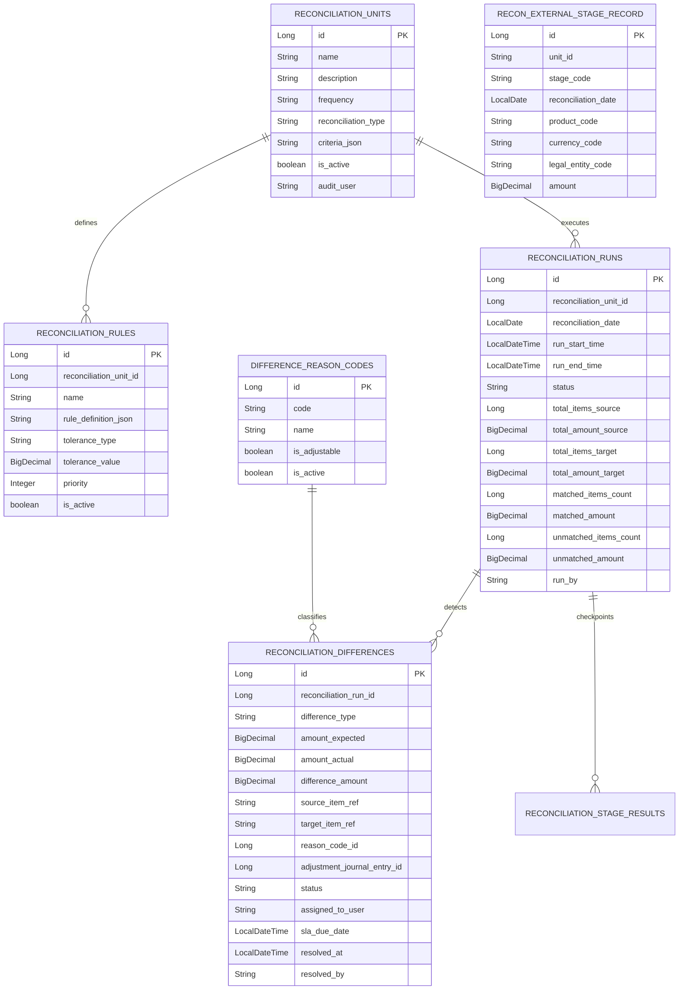

# reconciliation schema

## 핵심 ERD

## 상태

| 모델 | 상태 | 의미 |
| --- | --- | --- |
| `ReconciliationRun` | `RUNNING` | 대사 실행 중 |
| `ReconciliationRun` | `SUCCESS` | 대사 실행 완료 |
| `ReconciliationRun` | `FAILED` | 실행 중 예외 발생 |
| `ReconciliationRun` | `PARTIAL` | 부분 완료 확장 지점 |
| `ReconciliationDifference` | `PENDING` | 차이 처리 대기 |
| `ReconciliationDifference` | `ASSIGNED` | 담당자 배정 |
| `ReconciliationDifference` | `IN_REVIEW` | 검토 중 |
| `ReconciliationDifference` | `RESOLVED` | 해결 완료 |
| `ReconciliationDifference` | `IGNORED` | 업무적으로 무시 처리 |

## 기준정보 보존 정책

- `ReconciliationUnit` 삭제 API는 실제 삭제가 아니라 `isActive=false`로 바꾼다.
- `DifferenceReasonCode` 삭제 API도 `isActive=false`로 바꾼다.
- `ReconciliationRule` 삭제 API도 `isActive=false`로 바꾼다.

초보자 관점에서는 "사용 중지"와 "삭제"를 구분해야 한다. 대사 실행 이력은 과거에 어떤 단위, 규칙, 사유 코드로 판단했는지 나중에 감사할 수 있어야 하므로 기준정보를 DB에서 없애지 않는다. 새 실행에서만 쓰지 못하게 `isActive=false`로 닫는다.

## 외부 참조

- `ExternalReconSnapshotPort`: 외부 원천 단계 집계 조회.
- `JournalQueryPort`: 대상 원장 집계와 조정 전표 존재 확인.
- `JournalPostingPort`: 조정 전표 초안 생성.

조정 전표 생성 시 `lineageSourceId`는 `RECON_ADJ-RUN-{runId}-DIFF-{differenceId}-DR-{debitAccount}-CR-{creditAccount}` 형식이다. 시간값을 넣지 않기 때문에 같은 대사 실행/차이에 대한 재시도는 같은 외부 참조 키를 사용한다.
