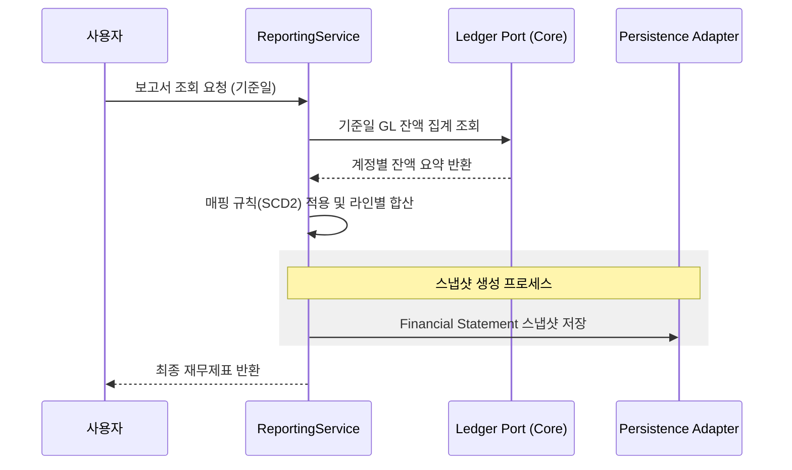
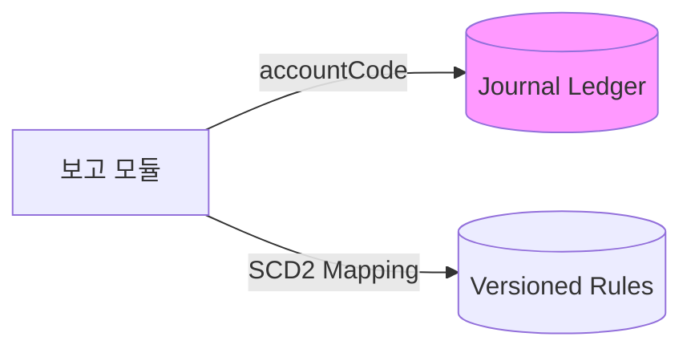
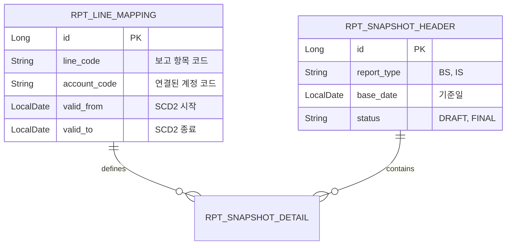

# 📊 Reporting Service (재무 보고 및 분석 관리)

`reporting` 모듈은 분산된 전표와 원장 데이터를 집계하여 재무상태표, 손익계산서 등의 공신력 있는 재무 보고서를 생성하고 시점별 스냅샷을 관리합니다.

---

## 1. 🐣 초보자를 위한 개념 설명 (Beginner Guide)

**보고서는 '수만 장의 영수증을 한 장의 요약표로 요약하는 것'입니다.**
1. **보고 라인 (Report Line):** 가계부의 '식비', '교통비' 같은 요약 항목입니다.
2. **매핑 (Mapping):** 어떤 영수증(계정)을 어떤 요약 항목(보고 라인)에 넣을지 정하는 규칙입니다.
3. **스냅샷 (Snapshot):** 특정 날짜의 재무 상태를 사진 찍듯 고정해서 저장해둔 데이터입니다. 나중에 "작년 숫자가 왜 이랬지?" 할 때 꺼내보는 증거가 됩니다.
4. **드릴스루 (Drill-through):** 보고서의 요약된 숫자를 클릭했을 때, 그 숫자를 만든 상세 전표 내역까지 끝까지 파고들어 보여주는 기능입니다.

---

## 2. 🔄 프로세스 흐름 (Process Flow)

### 📌 재무제표 실시간 산출 및 스냅샷 저장
원장 데이터 수집부터 보고서 생성, 영속화까지의 헥사고날 아키텍처 흐름입니다.



### 📌 아키텍처 원칙: ID 기반 연동 및 SCD2 매핑
보고서 매핑 규칙은 **SCD2**로 관리하여 과거 시점 재현을 보장하며, 타 모듈과는 **ID(Code)** 기반으로 통신합니다.



---

## 3. 📊 데이터 모델 (Schema)

보고서 구조와 확정된 스냅샷을 관리하는 테이블 구조입니다.



---

## 4. 🐳 실행 및 연동 방법

**실행 명령:**
```bash
docker-compose up -d reporting
```

**연동 주의사항:**
- 실시간 집계 시 `LedgerQueryPort`를 통해 `journal-ledger` 모듈의 최신 잔액을 가져옵니다.
- 보고서 서식 변경 시 SCD2 정책에 따라 기존 매핑의 `valid_to`를 닫고 새 버전을 생성해야 합니다.
