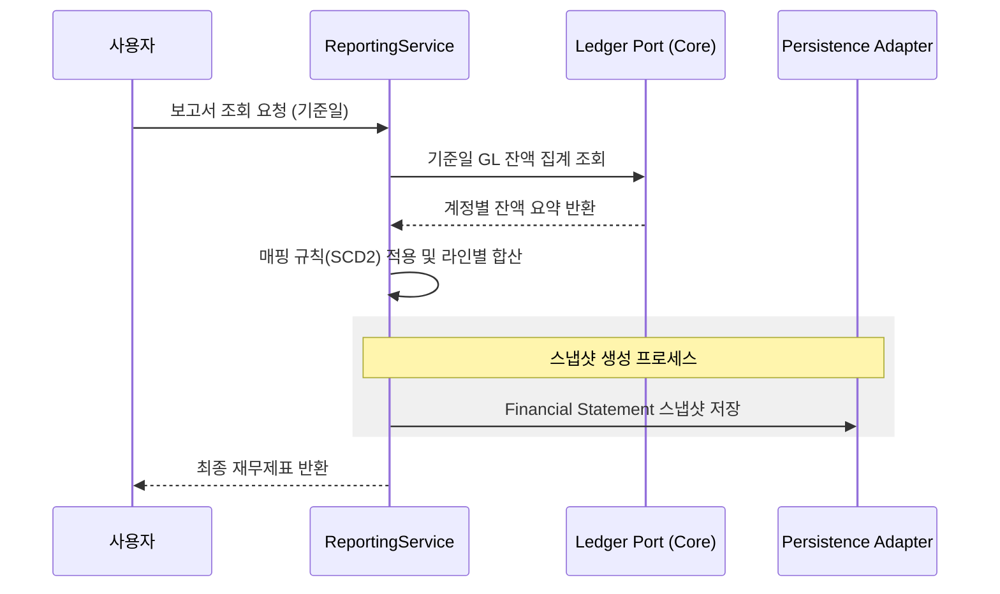
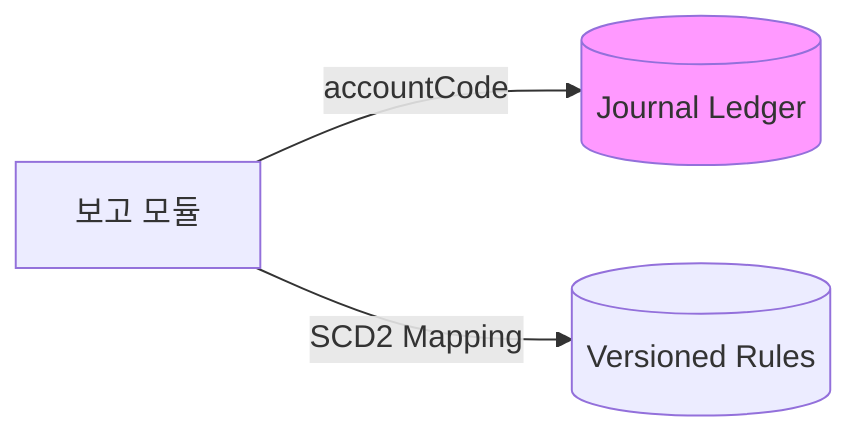
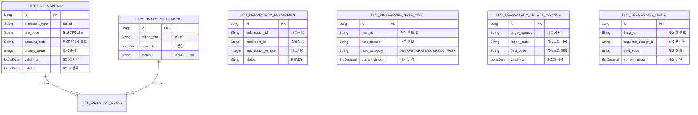

# 📊 Reporting Service (재무 보고 및 분석 관리)

`reporting` 모듈은 분산된 전표와 원장 데이터를 집계하여 재무상태표, 손익계산서 등의 공신력 있는 재무 보고서를 생성하고 시점별 스냅샷을 관리합니다.

---

## 1. 🐣 초보자를 위한 개념 설명 (Beginner Guide)

**보고서는 '수만 장의 영수증을 한 장의 요약표로 요약하는 것'입니다.**
1. **보고 라인 (Report Line):** 가계부의 '식비', '교통비' 같은 요약 항목입니다.
2. **매핑 (Mapping):** 어떤 영수증(계정)을 어떤 요약 항목(보고 라인)에 넣을지 정하는 규칙입니다.
3. **스냅샷 (Snapshot):** 특정 날짜의 재무 상태를 사진 찍듯 고정해서 저장해둔 데이터입니다. 나중에 "작년 숫자가 왜 이랬지?" 할 때 꺼내보는 증거가 됩니다.
4. **드릴스루 (Drill-through):** 보고서의 요약된 숫자를 클릭했을 때, 그 숫자를 만든 상세 전표 내역까지 끝까지 파고들어 보여주는 기능입니다.
5. **주석 마트 (Disclosure Note Mart):** 재무제표의 주석 번호별 금액을 만기, 금리, 통화, 리스크 관점으로 다시 정리한 공시용 데이터입니다.

---

## 2. 🔄 프로세스 흐름 (Process Flow)

### 📌 재무제표 실시간 산출 및 스냅샷 저장
원장 데이터 수집부터 보고서 생성, 영속화까지의 헥사고날 아키텍처 흐름입니다.



### 📌 아키텍처 원칙: ID 기반 연동 및 SCD2 매핑
보고서 매핑 규칙은 **SCD2**로 관리하여 과거 시점 재현을 보장하며, 타 모듈과는 **ID(Code)** 기반으로 통신합니다.



### 📌 감독보고 제출본 버전 관리
- `POST /api/v1/reporting/submissions/regulatory`
- 확정된 재무제표 스냅샷을 외부 제출 가능한 제출본으로 등록합니다.
- 같은 보고서 종류와 기준일에 대해 제출 이력이 있으면 버전을 1씩 증가시킵니다.
- 2차 제출부터는 `correctionReason`이 필수입니다.
- 제출 전 보고 라인 중복, 필수 금액, 합계 논리(BS 총계/IS 순액)를 검증합니다.

### 📌 주석 마트 생성 및 조회
- `POST /api/v1/reporting/disclosure-notes/generate`
- `GET /api/v1/reporting/disclosure-notes`
- 확정된 재무제표 스냅샷의 `noteNumber`가 있는 라인을 주석 마트로 전개합니다.
- 라인 코드/주석 번호 기준으로 만기, 금리, 통화, 리스크 범주를 분류하고 금액과 전기 비교 금액을 함께 저장합니다.
- 재생성 시 같은 보고서 종류와 기준일의 기존 마트를 교체 저장합니다.

### 📌 감독보고 매핑 및 제출
- `POST /api/v1/reporting/regulatory-filings/submit`
- `GET /api/v1/reporting/regulatory-filings/latest`
- 확정 제출본과 주석 마트를 기준으로 `RPT_REGULATORY_REPORT_MAPPING`의 SCD2 매핑을 적용해 감독보고 제출 패키지를 만듭니다.
- 로컬 제출 게이트웨이는 접수 영수증을 반환하고, 제출 라인과 영수증은 `RPT_REGULATORY_FILING`에 저장합니다.
- 기본 대상 기관은 `FSS`이며, 기본 BS/IS 감독보고 매핑 seed가 포함되어 있습니다.

---

## 3. 📊 데이터 모델 (Schema)

보고서 구조와 확정된 스냅샷을 관리하는 테이블 구조입니다.



---

## 4. 🧭 로컬 실행 및 연동 방법

현재 `reporting`은 상위 집계 프로젝트이고 실제 코드는 `reporting:core`, `reporting:api`, `reporting:batch`에 있습니다.
`reporting:core`는 도메인/유즈케이스/어댑터를 담는 library 모듈이고, `reporting:api`와 `reporting:batch`는 standalone Spring Boot 앱입니다. `reporting:api`는 Controller에서 core command를 호출한 뒤 응답 전용 DTO로 변환하므로, `FinancialStatement`, `DisclosureNoteMart`, `RegulatoryFiling` 같은 도메인 객체를 HTTP JSON 계약으로 직접 노출하지 않습니다.

**PowerShell 로컬 실행 명령:**
```powershell
.\gradlew :reporting:api:bootRun --args="--spring.profiles.active=local --server.port=8090 --spring.cloud.config.enabled=false --spring.cloud.discovery.enabled=false --spring.cloud.loadbalancer.enabled=false --spring.cloud.vault.enabled=false --eureka.client.enabled=false --account.reporting.persistence.mode=memory --spring.flyway.enabled=false --spring.jpa.hibernate.ddl-auto=create-drop" --console=plain

.\gradlew :reporting:batch:bootRun --args="--spring.profiles.active=local --spring.cloud.config.enabled=false --spring.cloud.discovery.enabled=false --spring.cloud.loadbalancer.enabled=false --spring.cloud.vault.enabled=false --eureka.client.enabled=false --account.reporting.persistence.mode=memory --spring.batch.job.enabled=false --spring.batch.jdbc.initialize-schema=always --spring.flyway.enabled=false --spring.jpa.hibernate.ddl-auto=create-drop" --console=plain
```

**PowerShell 검증 명령:**
```powershell
.\gradlew :reporting:core:test :reporting:api:test :reporting:batch:test --console=plain --max-workers=1 --no-daemon
.\gradlew :reporting:api:bootJar :reporting:batch:bootJar --console=plain --max-workers=1 --no-daemon
```

**IntelliJ 실행 순서:**
1. 루트 프로젝트를 Gradle 프로젝트로 연다.
2. Gradle JVM을 JDK 17로 맞춘다.
3. Run Configuration에서 `Reporting API bootRun`, `Reporting Batch Context`, `Reporting Module Tests` 중 목적에 맞는 구성을 실행한다.
4. 처음에는 공유 실행 설정에 포함된 `spring.profiles.active=local`, `account.reporting.persistence.mode=memory`로 logstash 없이 샘플 GL 잔액과 인메모리 어댑터 흐름을 확인한다.

**연동 주의사항:**
- 실시간 집계 시 `LoadLedgerPort`를 통해 `journal-ledger` 모듈의 최신 잔액을 가져옵니다.
- API 응답은 `reporting:api/.../dto`의 response DTO가 담당합니다. 초보자는 "core는 업무 판단, api는 외부 JSON 모양"으로 나눠 보면 됩니다.
- 보고서 서식 변경 시 SCD2 정책에 따라 기존 매핑의 `valid_to`를 닫고 새 버전을 생성해야 합니다.
- 현재 기본 구현은 `JpaReportLineMappingAdapter`와 `JpaReportSnapshotAdapter`가 `RPT_LINE_MAPPING`, `RPT_SNAPSHOT_HEADER`, `RPT_SNAPSHOT_DETAIL` 테이블을 사용합니다.
- 감독보고 제출본은 `RPT_REGULATORY_SUBMISSION`에 기준일별 버전과 정정 사유를 저장합니다.
- 주석 마트는 `RPT_DISCLOSURE_NOTE_MART`에 note 번호, 공시 범주, 만기/금리/통화/리스크 분류와 금액을 저장합니다.
- 감독보고 매핑과 제출 이력은 `RPT_REGULATORY_REPORT_MAPPING`, `RPT_REGULATORY_FILING`에 저장합니다.
- 로컬 감독보고 게이트웨이 반려 시뮬레이션은 `account.reporting.regulatory-filing.failure-simulation.enabled` 설정으로 켜고 끕니다. 기본값은 `false`이며 랜덤 실패는 사용하지 않습니다.
- Flyway `V60__reporting_persistence_schema.sql`은 기본 BS/IS 매핑 데이터를 함께 적재하고, `V61__reporting_regulatory_submission.sql`은 제출본 테이블, `V62__reporting_disclosure_note_mart.sql`은 주석 마트 테이블, `V63__reporting_regulatory_filing.sql`은 감독보고 매핑/제출 테이블을 생성합니다.
- 로컬 데모처럼 DB 없이 인메모리 어댑터를 쓰려면 `account.reporting.persistence.mode=memory`를 설정합니다. 운영형 JPA 모드는 실제 `LedgerQueryPort` 구현과 보고 라인 매핑 seed가 필요합니다.
- 상세 문서는 [docs/README.md](./docs/README.md)에서 `beginner-guide`, `process-flow`, `schema`, `local-run` 순서로 확인합니다.
