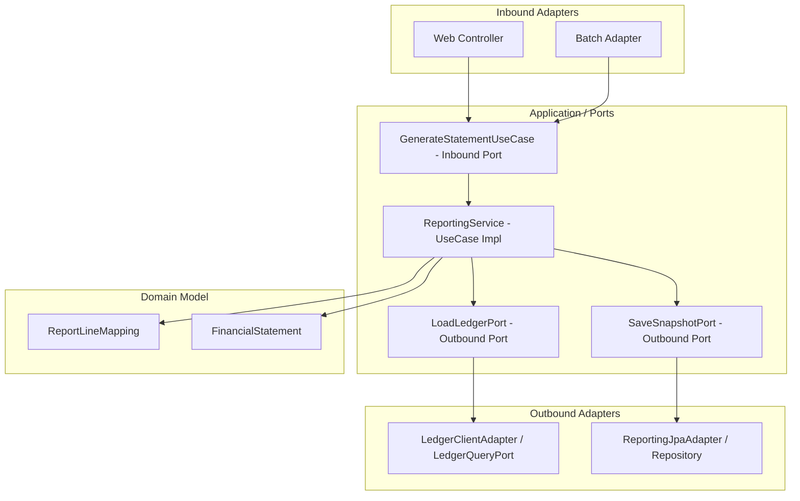

# reporting process flow

## 1. 이 모듈이 하는 일

`reporting`은 원장 데이터를 재무제표, 스냅샷, 공시 제출용 데이터로 변환하는 모듈입니다. 헥사고날 아키텍처(Ports and Adapters)를 채택하여, 핵심 도메인 로직을 외부 시스템(웹, DB)으로부터 철저히 격리합니다.

핵심 책임:
- 보고 라인 매핑 관리 (SCD2 이력 관리)
- 실시간 재무제표 계산
- 보고 스냅샷 생성
- 드릴스루 (ID 기반 전표 추적)
- 보고 교차검증

## 2. 전체 흐름도 (Hexagonal Architecture View)

## 3. 핵심 흐름 설명

### 3.1 보고 라인 매핑 관리 (SCD2 기반)

- **도메인**: `ReportLineMapping`
- 규칙이 변경될 때 기존 매핑을 `UPDATE` 덮어쓰기 하는 것이 아니라, 새로운 버전을 `INSERT` 하고 기존 버전의 `validToDate`를 닫습니다. (Slowly Changing Dimensions Type 2 방식)
- 과거 기준일자로 보고서를 뽑을 때는 그 시점에 유효했던 버전을 찾아 계산합니다.

### 3.2 실시간 재무제표 계산

- **Inbound Port**: `GenerateStatementUseCase.generateBalanceSheet`
- 계산 방식:
  - `ReportLineMapping` 도메인 모델을 조회합니다.
  - 외부 어댑터(`LoadLedgerPort`)가 `LedgerQueryPort`를 호출해 기준일의 GL 잔액 요약을 가져옵니다. (ID/계약 기반으로 참조하여 느슨하게 결합)
  - 계정 카테고리와 차대 방향을 확인해 금액 부호를 정하고 합산합니다.
  - 현재 구현은 확정 스냅샷 저장소가 없으면 전기 비교금액을 0으로 처리합니다.

### 3.3 스냅샷 생성

- 기준일자에 유효한 매핑을 조회합니다.
- `SaveSnapshotPort`를 통해 계산된 `FinancialStatement` 데이터를 영속화(DB 저장)합니다.
- JPA Entity인 `ReportSnapshotHeaderJpaEntity`와 `ReportSnapshotDetailJpaEntity`로 변환되어 저장됩니다.

### 3.4 드릴스루 (Drill-through)

- 특정 보고 라인(예: 현금 100만 원)을 구성하는 원천 전표 내역을 역추적합니다.
- 다른 모듈의 객체를 직접 로딩하지 않고, 보관하고 있던 전표의 `ID` 목록을 이용해 `journal-ledger` 모듈의 API/어댑터를 호출하여 상세 내역을 받아옵니다.

## 4. Multi-stage Docker 환경 배포 흐름

`reporting` 모듈은 개발, 테스트, 운영 환경에 맞춰 빌드 및 배포됩니다. 도커 환경에서는 빌드 스테이지와 실행 스테이지가 나뉘어 최종 이미지가 가볍게 유지됩니다.
