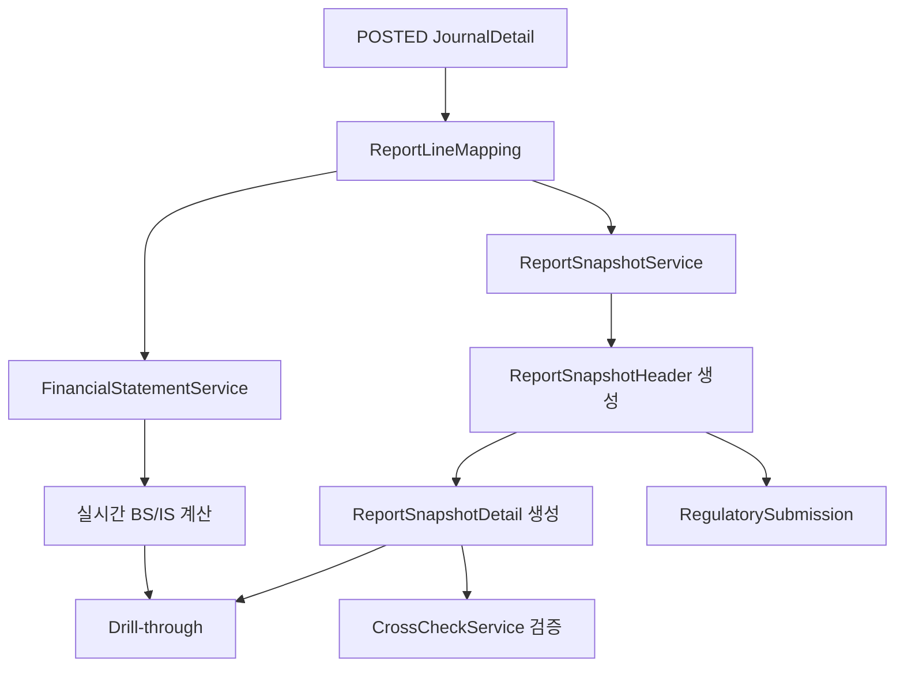
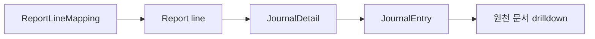

# reporting process flow

## 1. 이 모듈이 하는 일

`reporting`은 원장 데이터를 재무제표, 스냅샷, 공시 제출용 데이터로 바꾸는 모듈이다.

핵심 책임:

- 보고 라인 매핑 관리
- 실시간 재무제표 계산
- 보고 스냅샷 생성
- 드릴스루 제공
- 보고 교차검증
- 공시/노트/마트 데이터 저장

## 2. 전체 흐름도

## 3. 핵심 흐름 설명

### 3.1 보고 라인 매핑 관리

- 서비스: `ReportMappingService`
- 역할:
  - 라인 코드와 계정코드의 연결 관리
  - 유효기간과 버전 관리
  - 새 버전 생성 시 기존 버전 `validToDate` 종료

즉, 같은 라인 코드도 시점에 따라 다른 매핑을 가질 수 있다.

### 3.2 실시간 재무제표 계산

- 서비스: `FinancialStatementService`
- 주요 메서드:
  - `generateBalanceSheet`
  - `generateIncomeStatement`

계산 방식:

- `ReportLineMapping`을 읽는다
- `POSTED` 상태 전표만 집계한다
- 계정 카테고리와 차대 방향을 보고 부호를 계산한다

### 3.3 스냅샷 생성

- 서비스: `ReportSnapshotService.createSnapshot`
- 처리:
  - 기준일자에 유효한 매핑 조회
  - 라인별 금액 계산
  - `ReportSnapshotHeader` 생성
  - `ReportSnapshotDetail` 다건 생성
  - 같은 보고유형/기준일자의 버전 번호 증가

### 3.4 드릴스루

- `FinancialStatementService.getJournalDetailsByReportLine`
- `ReportSnapshotService.getContributingJournals`

동작:

- 특정 보고 라인에 연결된 계정 코드를 찾는다
- 해당 계정의 전표 상세를 기간 조건으로 조회한다
- 원천 전표까지 내려가 볼 수 있다

### 3.5 교차검증

- 서비스: `CrossCheckService`
- 현재 구현:
  - 대차대조표에서 `TOTAL_ASSETS = TOTAL_LIABILITIES + TOTAL_EQUITY` 검증

## 4. 드릴스루 흐름도

## 5. 초보자가 꼭 기억할 포인트

- 이 모듈은 `POSTED` 전표만 신뢰한다.
- 보고 숫자는 매핑 테이블 품질에 크게 의존한다.
- 실시간 조회와 스냅샷 저장은 별도 흐름이다.
- FORMULA 집계는 아직 제한적이며 SUM 중심 구현이다.
