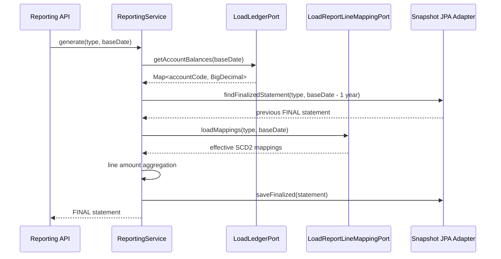

# Reporting Process Flow

## 재무제표 생성

## 계층 책임

- `application.service`: 유즈케이스 흐름, 트랜잭션, 포트 협업을 담당합니다.
- `application.port.out`: 원장 조회, 매핑 조회, 스냅샷 저장 계약만 정의합니다.
- `domain.model`: 보고서, 라인, 매핑 유효성 같은 비즈니스 규칙을 보유합니다.
- `infrastructure.persistence`: JPA/Flyway 기반 DB 접근과 인메모리 데모 어댑터를 구현합니다.
