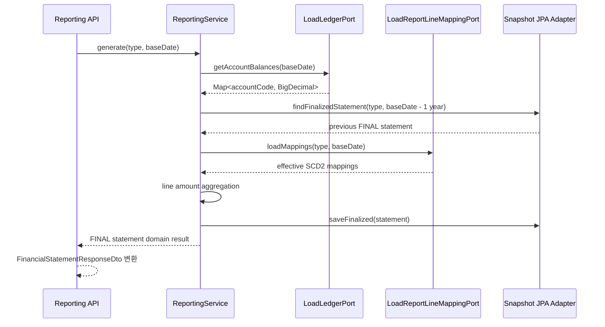
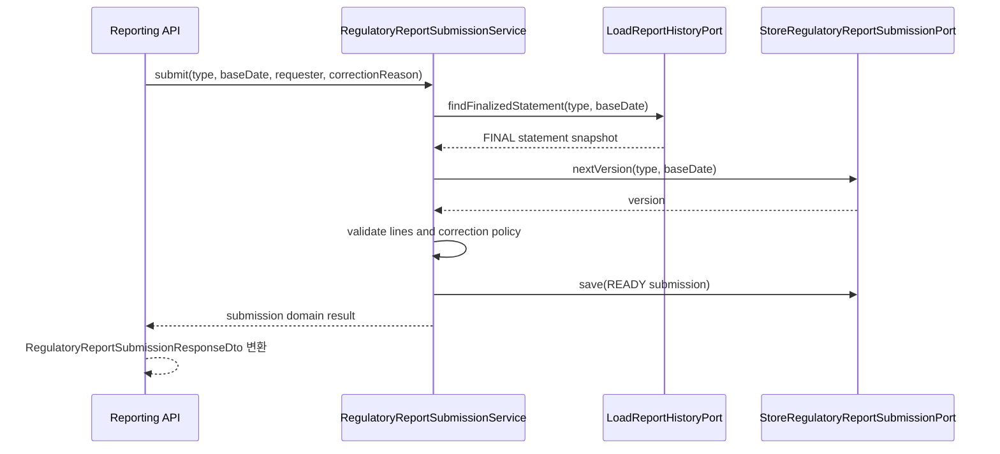
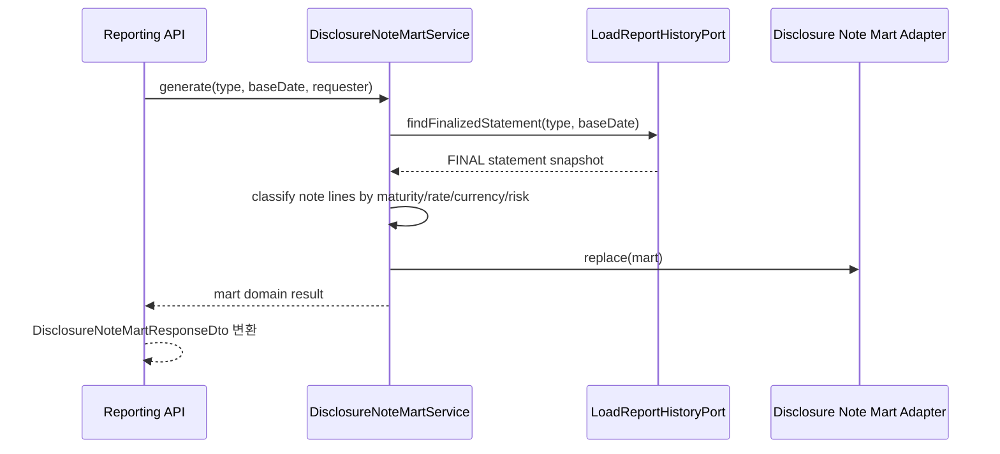
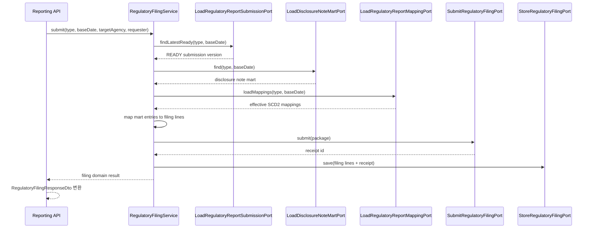
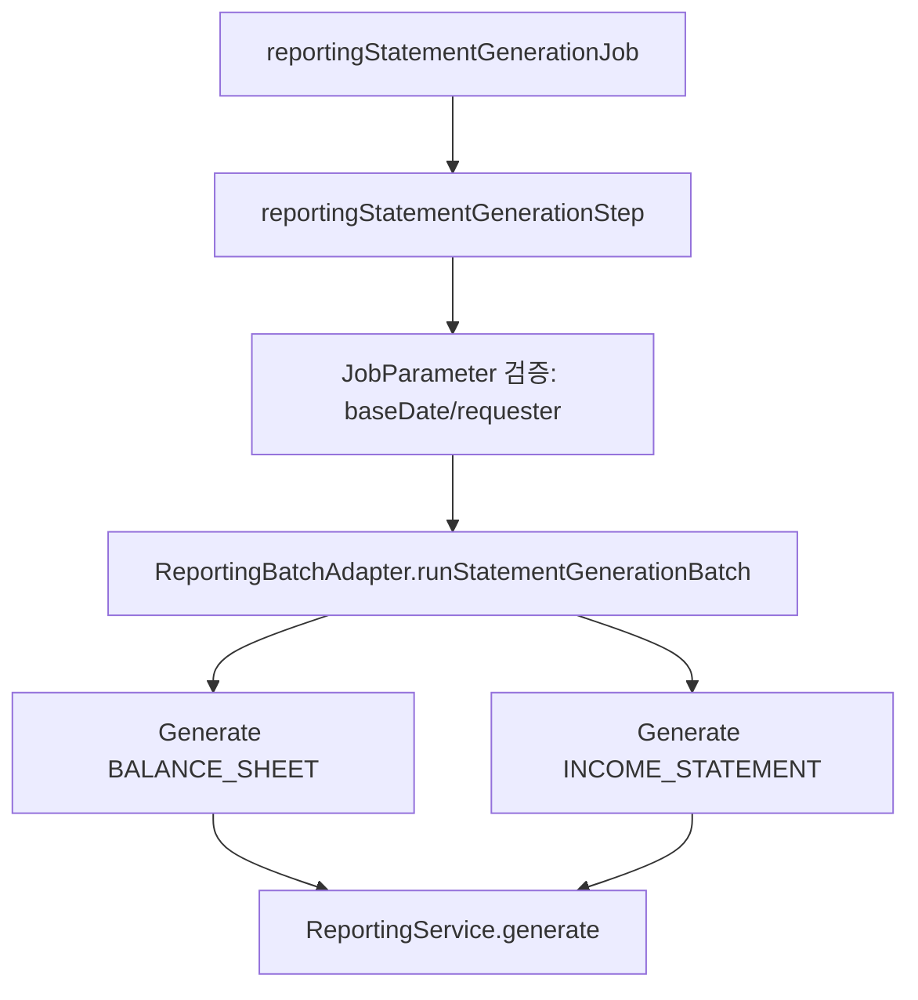

# Reporting Process Flow

## 재무제표 생성

## 감독보고 제출본 등록

## 주석 마트 생성

## 감독보고 매핑 및 제출

## 계층 책임

- `application.service`: 유즈케이스 흐름, 트랜잭션, 포트 협업을 담당합니다.
- `application.port.out`: 원장 조회, 매핑 조회, 스냅샷 저장 계약만 정의합니다.
- `domain.model`: 보고서, 라인, 매핑 유효성 같은 비즈니스 규칙을 보유합니다.
- `api/.../dto`: 외부 HTTP 응답 모양을 고정합니다. 도메인 모델을 그대로 직렬화하지 않고 response DTO로 변환합니다.
- `infrastructure.persistence`: JPA/Flyway 기반 DB 접근과 인메모리 데모 어댑터를 구현합니다.

## 문서 Export와 Drill-through

- `POST /api/v1/reporting/generate/document`: 보고서 생성 후 PDF 또는 CSV 형식으로 렌더링합니다.
- `GET /api/v1/reporting/disclosure-notes/drill-down`: 주석 마트 엔트리의 원천 계정코드를 찾아 해당 월의 전표 상세를 `JournalQueryPort`로 조회합니다.

## Batch Adapter 흐름

현재 Batch Adapter는 Spring Batch Step에서 호출하는 인바운드 어댑터입니다.
운영자는 `reportingStatementGenerationJob`을 실행할 때 `baseDate=yyyy-MM-dd`, `requester=사용자ID` JobParameter를 넘겨 재실행 이력을 남깁니다.
초보자 관점에서는 `Job`이 실행 이력의 단위, `Step`이 실제 처리 단위, `JobParameter`가 같은 배치를 구분하는 실행 조건입니다.

## 현재 고도화 후보

- `LocalRegulatoryFilingGatewayAdapter`의 반려 시뮬레이션은 랜덤이 아니라 설정값으로 제어합니다.
- `account.reporting.regulatory-filing.failure-simulation.enabled=true`이면 항상 같은 반려 메시지로 실패하고, 기본값은 `false`라 로컬/테스트 제출은 재현 가능하게 성공합니다.
