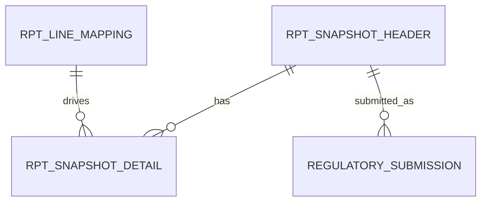
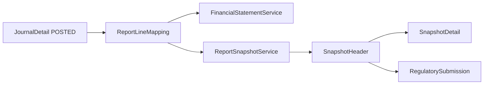

# reporting schema

## 1. 한눈에 보는 구조

## 2. 핵심 엔티티

### 2.1 `RPT_LINE_MAPPING`

보고 라인과 계정 매핑 정의다.

주요 컬럼:

- `REPORT_TYPE`
- `LINE_CODE`
- `LINE_NAME`
- `ACCOUNT_CODE`
- `AGGREGATION_TYPE`
- `FORMULA_EXPRESSION`
- `DISPLAY_ORDER`
- `PARENT_LINE_CODE`
- `VERSION`
- `VALID_FROM_DATE`
- `VALID_TO_DATE`

핵심 의미:

- `REPORT_TYPE`: `BS`, `IS`, `CF`, `REGULATORY`
- `AGGREGATION_TYPE`: `SUM`, `DIFF`, `FORMULA`
- 버전과 유효기간을 통해 SCD2 유사 방식으로 관리

### 2.2 `RPT_SNAPSHOT_HEADER`

보고 스냅샷 헤더다.

주요 컬럼:

- `SNAPSHOT_ID`
- `REPORT_TYPE`
- `BASE_DATE`
- `VERSION`
- `STATUS`
- `DESCRIPTION`

상태값:

- `DRAFT`
- `FINAL`
- `SUBMITTED`

### 2.3 `RPT_SNAPSHOT_DETAIL`

스냅샷 라인 금액 상세다.

주요 컬럼:

- `SNAPSHOT_ID`
- `LINE_CODE`
- `AMOUNT`

### 2.4 `financial_reports`

최종 보고서 파일 메타데이터다.

주요 컬럼:

- `report_name`
- `report_date`
- `file_path`
- `file_type`

### 2.5 `financial_notes`

주석 저장 테이블이다.

주요 컬럼:

- `year_month`
- `note_category`
- `content`

### 2.6 `DISCLOSURE_MART`

공시용 집계 마트다.

주요 컬럼:

- `MART_TYPE`
- `BASE_DATE`
- `CATEGORY_1`
- `CATEGORY_2`
- `AMOUNT`
- `COUNT`

### 2.7 `REGULATORY_SUBMISSION`

제출 이력 테이블이다.

주요 컬럼:

- `REPORT_CODE`
- `SNAPSHOT_ID`
- `SUBMISSION_DATE`
- `SUBMITTER`
- `SUBMISSION_CHANNEL`
- `RESPONSE_STATUS`

## 3. 데이터 흐름 관점

## 4. 초보자용 해석

- `RPT_LINE_MAPPING`은 보고서 설계도다.
- `RPT_SNAPSHOT_HEADER/DETAIL`은 특정 날짜 기준 캡처본이다.
- `FinancialReport`, `FinancialNote`는 산출물과 설명 자료다.
- `DisclosureMart`는 공시/분석용 요약 저장소다.
