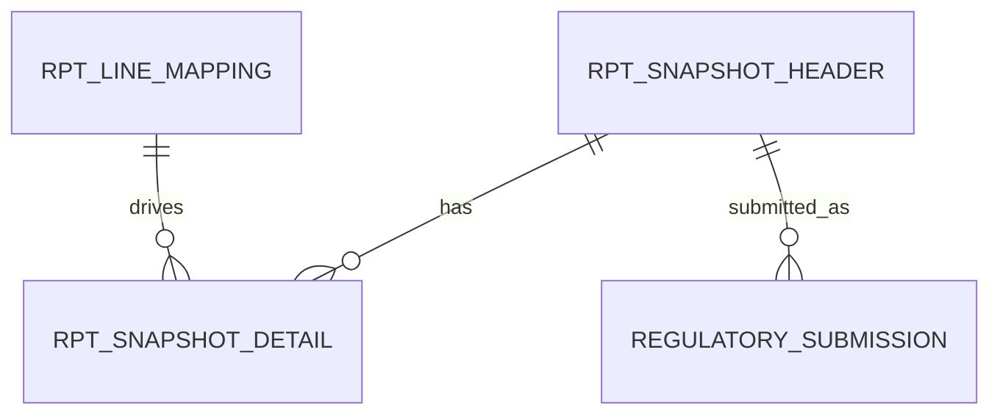
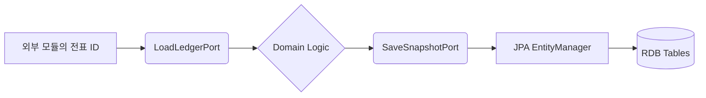

# reporting schema

## 1. 한눈에 보는 구조 (JPA Entity 중심)

헥사고날 아키텍처에 맞춰 실제 데이터베이스 테이블 구조는 Outbound Adapter 쪽에 위치하는 JPA Entity 구조로 매핑됩니다. 타 모듈의 정보는 객체가 아닌 ID 값으로 참조합니다.

## 2. 핵심 테이블/엔티티 (SCD2 및 ID 참조 기반)

### 2.1 `RPT_LINE_MAPPING` (JPA Entity: `ReportLineMappingJpaEntity`)

보고 라인과 타 모듈의 계정을 매핑합니다. 과거 이력을 보존하는 **SCD2 방식**을 따릅니다.

주요 컬럼:
- `MAPPING_ID` (PK)
- `REPORT_TYPE` (BS, IS 등)
- `LINE_CODE`
- `ACCOUNT_CODE` (타 모듈의 계정 코드를 단순 문자열/ID로 참조)
- `VERSION` (버전 관리)
- `VALID_FROM_DATE` (유효 시작일)
- `VALID_TO_DATE` (유효 종료일)

### 2.2 `RPT_SNAPSHOT_HEADER` (JPA Entity: `ReportSnapshotHeaderJpaEntity`)

특정 기준일에 산출된 보고서의 메타데이터(헤더)입니다.

주요 컬럼:
- `SNAPSHOT_ID` (PK)
- `REPORT_TYPE`
- `BASE_DATE`
- `VERSION`
- `STATUS` (DRAFT, FINAL, SUBMITTED)

### 2.3 `RPT_SNAPSHOT_DETAIL` (JPA Entity: `ReportSnapshotDetailJpaEntity`)

스냅샷 헤더에 딸린 보고 라인별 금액 상세 내역입니다.

주요 컬럼:
- `DETAIL_ID` (PK)
- `SNAPSHOT_ID` (FK)
- `LINE_CODE`
- `AMOUNT` (BigDecimal 등 정확한 금액 타입 사용)

### 2.4 공시 및 주석 엔티티

- **`DISCLOSURE_MART`**: 공시를 위한 요약 마트 테이블입니다. 외부 시스템과 연동하기 쉬운 구조를 가집니다.
- **`REGULATORY_SUBMISSION`**: 외부 기관 제출 이력을 관리합니다.

## 3. 데이터 흐름과 아키텍처 관점

## 4. 초보자용 해석

- **도메인 모델과 JPA 엔티티 분리**: 핵심 로직은 순수 Java 클래스인 도메인 객체를 쓰고, DB에 저장할 때만 `ReportSnapshotHeaderJpaEntity` 같은 객체로 변환합니다. 이것이 헥사고날 아키텍처의 핵심입니다.
- **`RPT_LINE_MAPPING`의 SCD2**: 누군가 매핑 규칙을 수정해도 옛날 데이터는 지워지지 않습니다. 그저 "언제까지 유효했음"이라고 표시만 해둘 뿐입니다. 
- **ID 기반 참조**: "계정" 정보가 필요할 때 해당 계정 테이블과 직접 조인(Join)하지 않습니다. 계정 모듈이 다른 서버(Docker 컨테이너)에 떠 있을 수도 있기 때문입니다. ID 값만 들고 있다가 필요할 때 호출합니다.
