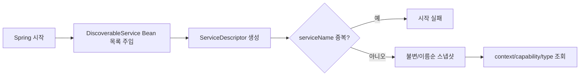
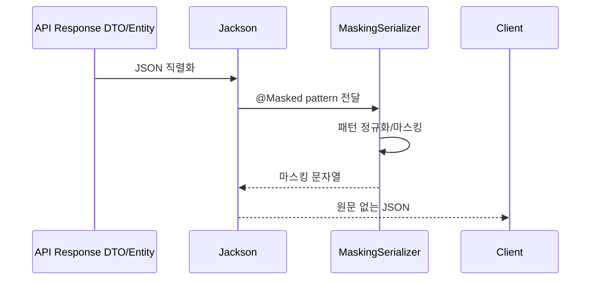

# Shared-Kernel 업무 및 데이터 흐름

## 1. 로컬 capability 레지스트리



메서드 순서:

1. 생성자에서 Bean 목록을 불변 복사합니다.
2. 각 Bean의 `descriptor()`를 한 번 호출합니다.
3. 서비스 이름으로 정렬합니다.
4. 중복 이름을 검증합니다.
5. 조회 메서드는 저장된 스냅샷을 함수형 filter/map으로 반환합니다.

이 구조는 `ApplicationContext.getBeansOfType()`를 업무 호출마다 실행하는 서비스 로케이터보다
의존성이 명확하고 결과 순서가 결정적입니다.

## 2. Source Document 조회와의 연결

```text
Journal SourceDocumentService
  -> ServiceDiscoveryRegistry.findByCapability(SOURCE_DOCUMENT_LOOKUP)
  -> SourceDocumentProvider 목록
  -> supports(lineageSourceType)
  -> getSourceDocument(type, id)
```

모두 같은 Spring 프로세스 안의 호출입니다. 원격 서비스로 분리되면 contracts 포트를 구현하는
REST/Feign 어댑터가 필요합니다.

## 3. JSON 마스킹



미지원 패턴과 너무 짧아 안전한 앞/뒤 노출 범위를 만들 수 없는 값은 전체 마스킹합니다.
마스킹은 JSON 출력 어댑터 정책이며 도메인 값 자체를 변경하지 않습니다.

## 4. ECL 이벤트의 현재 흐름과 TODO

```text
account-mart CdmEventPublisher
  -> CdmDataReadyEvent
  -> Kafka allowance-cdm-events
  -> ECL CdmDataReadyConsumer
  -> Spring Batch JobLauncher
```

현재 이벤트는 shared-kernel에 있지만 두 컨텍스트 전용 통합 계약입니다. `eventId`를 Spring Batch
JobInstance 멱등 키로 사용하도록 보강했지만 `schemaVersion`, producer와 실제 분산락은 없습니다.
운영 전 전용 계약 모듈과 명시적 락 포트, 동일 기준일 재실행 정책으로 분리해야 합니다.

## 5. 공용 Spring MVC 요청 오류 응답

`GlobalExceptionAdvice`는 현재 API 어댑터용 공용 타입입니다. 독립 서버나 전역 자동 등록
컴포넌트가 아니며, 각 API의 `@RestControllerAdvice`가 상속하여 등록합니다. 현재 소비자는
Master Data의 `MasterDataExceptionHandler`, account-mart의 `DataMartExceptionHandler`,
ECL의 `AllowanceEclExceptionHandler`입니다. 이 변경은 기존 위치의 요청 오류 분류를 고치며,
어댑터 소유권이나 업무 로직을 shared-kernel로 추가 이동하지 않습니다.

### 입력 → 처리 → 출력

1. 클라이언트가 HTTP method, query, Content-Type, JSON body를 보냅니다.
2. Spring MVC가 경로/method/media type을 선택하고 필수 인자와 본문을 해석합니다.
3. 아래 요청 오류가 발생하면 업무 Controller/use case에 진입하기 전에 처리됩니다.
   등록된 하위 advice가 상속한 구체 `@ExceptionHandler`를 선택하므로 일반 500 handler로
   흘러가지 않습니다.
4. handler가 고정 메시지와 `ApiResponse.failure`를 만들고 필요한 협상 헤더를 보존합니다.
   Jackson이 `success=false`, 명시적 `data=null`, `message`, `timestamp`를 JSON으로 출력합니다.

| Spring MVC 예외 | 상태 | 고정 message | 보존하는 응답 헤더 |
| --- | --- | --- | --- |
| `MissingServletRequestParameterException` | 400 | `Bad request` | 추가 헤더 없음 |
| `HttpMessageNotReadableException` | 400 | `Bad request` | 추가 헤더 없음 |
| `HttpRequestMethodNotSupportedException` | 405 | `Method not allowed` | 예외의 `getHeaders()`에 있는 `Allow` |
| `HttpMediaTypeNotSupportedException` | 415 | `Unsupported media type` | 예외의 `getHeaders()`에 있는 `Accept`, PATCH이면 `Accept-Patch` |

초보자 설명: 필수 query 누락이나 깨진 JSON은 서버 장애가 아니라 요청을 고쳐야 하는 오류입니다.
405의 `Allow`는 사용할 수 있는 method, 415의 `Accept`/`Accept-Patch`는 서버가 읽을 수 있는
본문 형식을 알려줍니다. 이 헤더를 버리지 않고 요청을 수정하도록 안내합니다. 같은 잘못된 요청을
그대로 재시도해도 해결되지 않습니다. 오류 handler 자체는 DB/업무 상태를 변경하지 않습니다.

새 네 예외의 메시지/cause, 원문 payload, `ProblemDetail.detail`에는 요청값이 포함될 수 있어
응답에 복사하지 않습니다. HTTP 상태와 허용 형식은 보존하되 오류 설명은 표의 고정 문구만
사용합니다. `HttpMessageNotReadableException`은 `ErrorResponse` 구현체가 아니므로 전체
`ErrorResponse` 처리로 대체하지 않습니다.

### 유지되는 계약과 제외 범위

- `ResourceNotFoundException`: 404와 기존 업무 메시지.
- `MethodArgumentNotValidException`: 400과 기존 `필드: 검증 메시지` 조합.
- `IllegalArgumentException`: 400과 기존 예외 메시지.
- 하위 advice의 더 구체적인 업무 예외 handler: 기존 409 우선순위 유지.
- 그 외 일반 `Exception`: 500, 정확히 `Internal server error`; 원문/cause 비노출.

위 기존 업무 메시지 정책까지 모두 고정 문구로 바꾸는 작업은 아닙니다. `ResponseStatusException`,
전체 `ErrorResponse` 자동 처리, 인증/인가 정책과 Controller/서비스/route 변경은 제외합니다.
특히 Master Data의 별도 `ResponseStatusException(FORBIDDEN)` 경로는 이번 검증 범위가 아닙니다.

### 로컬 검증 전제와 실행 예

저장소 루트 작업 디렉터리, 기설치 JDK 17/Gradle 8.7과 기존 의존성 캐시가 필요합니다.
아래 Windows 경로는 검증 환경의 실제 설치 위치입니다. 다른 환경에서는 기존 설치 위치로만
치환하며, 캐시가 없을 때 설치/다운로드하거나 `--offline`을 제거하지 않습니다.

`GlobalExceptionAdviceMvcTest`는 실제 Spring MockMvc의 요청 처리와 advice 상속을 사용하지만,
Controller/use case는 합성 fixture/mock입니다. 외부 HTTP 서버, DB, 인증 필터는 실행하지 않습니다.
검증 오류는 테스트 전용 Spring `Validator`로 만들어 실제 MVC의
`MethodArgumentNotValidException` 분기를 확인하며, Bean Validation provider의 배선 검증은 아닙니다.

`ApiResponse.timestamp`는 `LocalDateTime`입니다. Boot 자동 구성이 없는 standalone MockMvc에는
`JavaTimeModule`과 ISO 날짜 문자열 설정을 가진 Jackson converter를 명시합니다. 날짜 지원이
없으면 advice의 JSON 직렬화가 실패하고 framework fallback 400이 발생할 수 있으므로 상태 코드만
검사하면 안 됩니다. 테스트는 JSON 네 필드의 존재, `data`의 명시적 null, 메시지, 파싱 가능한
timestamp까지 확인합니다. 요청 파싱/dispatch 실패에서는 mock use case 무호출도 검증합니다.

```powershell
$env:JAVA_HOME = 'C:/Program Files/Eclipse Adoptium/jdk-17.0.19.10-hotspot'

# 공용 advice 직접 호출 + 실제 MockMvc 경로
& 'C:/Users/skyg5/.gradle/wrapper/dists/gradle-8.7-bin/bhs2wmbdwecv87pi65oeuq5iu/gradle-8.7/bin/gradle.bat' :shared-kernel:test --tests '*GlobalExceptionAdvice*' --offline --no-daemon --console=plain --max-workers=1 '-Porg.gradle.java.installations.paths=C:/Program Files/Eclipse Adoptium/jdk-17.0.19.10-hotspot'

# 공용 모듈과 상속 소비자 세 API의 기존 회귀
& 'C:/Users/skyg5/.gradle/wrapper/dists/gradle-8.7-bin/bhs2wmbdwecv87pi65oeuq5iu/gradle-8.7/bin/gradle.bat' :shared-kernel:test :contracts:test :master-data:api:test :account-mart:mart-api:test :ecl:ecl-api:test --offline --no-daemon --console=plain --max-workers=1 '-Porg.gradle.java.installations.paths=C:/Program Files/Eclipse Adoptium/jdk-17.0.19.10-hotspot'
```

기대 결과는 `BUILD SUCCESSFUL`, 각 실행의 테스트 실패/오류/skip 0입니다. MVC 검증은 필수 query
누락/깨진 JSON의 400, method 405/Allow, POST 415/Accept와 Accept-Patch 부재, PATCH
415/Accept/Accept-Patch, 기존 400/404/하위 409/비노출 500 및 정상 요청을 확인합니다.
테스트 전용 Servlet API 6.0.0과 BOM 정렬 `jackson-datatype-jsr310`만 추가하며 production의
`compileOnly` Servlet API나 BOM은 바꾸지 않습니다. 로컬 소비자 검증은 전체 모듈 CI나 실제
배포/인증/외부 연동 검증을 대체하지 않습니다. shared-kernel 변경은 전체 모듈 CI 게이트가 남습니다.
