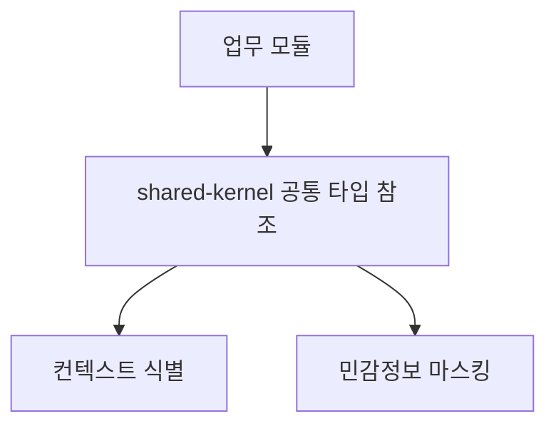
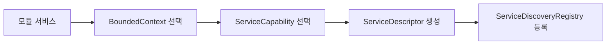
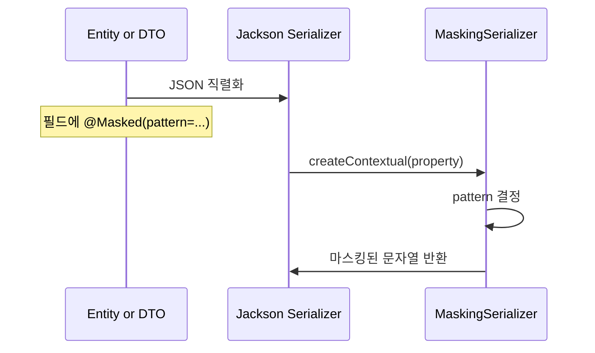

# Shared-Kernel Process Flow

## 1. 전체 역할



설명:
- `shared-kernel`은 직접 비즈니스를 처리하지 않습니다.
- 여러 모듈이 같은 언어와 같은 규칙을 공유하도록 돕습니다.

## 2. 서비스 메타정보 흐름



설명:
- `ServiceDescriptor`는 서비스 이름, 소속 컨텍스트, capability, 설명을 함께 묶습니다.
- 모듈 카탈로그, 서비스 등록 정보, 포트 라우팅 기준으로 쓸 수 있는 구조입니다.

## 3. 데이터 마스킹 흐름



설명:
- 필드에 `@Masked`가 붙어 있으면 `MaskingSerializer`가 패턴을 읽습니다.
- 패턴에 따라 다른 마스킹 규칙을 적용합니다.

## 4. 패턴별 처리 흐름

```mermaid
flowchart TD
    A[@Masked(pattern)] --> B{pattern}
    B -- REG_NO --> C[등록번호 마스킹]
    B -- ACCOUNT --> D[계좌번호 마스킹]
    B -- EMAIL --> E[이메일 마스킹]
    B -- 기타 --> F[기본 **********]
```

현재 지원 패턴:
- `REG_NO`
- `ACCOUNT`
- `EMAIL`
- 기본값 `DEFAULT`

## 5. 현재 구현상 주의점

- `MaskingSerializer`는 Jackson 설정에 연결되어야 실제로 동작합니다.
- 패턴별 규칙은 간단한 문자열 가공 수준입니다.
- 서비스 디스커버리는 현재 Spring Bean 수집 기반이며, 이후 외부 레지스트리로 확장할 수 있습니다.
- `BoundedContext` 구분은 실제 분리 후보 모듈 경계를 기준으로 유지합니다.
