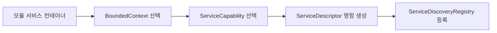
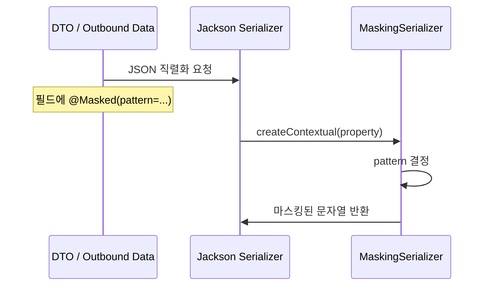

# Shared-Kernel Process Flow

## 1. 전체 역할

```mermaid
flowchart TD
    A[업무 모듈(헥사고날 포트/어댑터)] --> B[shared-kernel 공통 타입 참조]
    B --> C[Bounded Context 식별]
    B --> D[민감정보 마스킹 처리]
    B --> E[ID 기반 참조 타입 활용]
```

설명:
- `shared-kernel`은 직접 비즈니스를 처리하지 않습니다.
- 헥사고날 아키텍처 기반의 여러 독립된 모듈들이, 서로 데이터를 주고받거나(포트 통신), 서비스 디스커버리를 할 때 사용하는 최소한의 규칙과 타입을 제공합니다.

## 2. 서비스 메타정보 흐름 (Multi-stage Docker & Service Discovery)

Docker 컨테이너로 각각 배포되는 모듈들은 런타임에 서로를 찾아야 합니다.



설명:
- `ServiceDescriptor`는 서비스 이름, 소속 컨텍스트, capability, 설명을 함께 묶습니다.
- MSA 환경(다수의 Docker 컨테이너)에서 모듈 카탈로그, 서비스 등록 정보, API 게이트웨이 라우팅 기준으로 쓰이는 핵심 구조입니다.

## 3. 데이터 마스킹 흐름 (Outbound Adapter 레벨)

외부로 데이터를 내보낼 때(API 응답, 로그 출력 등), 민감 정보가 노출되지 않도록 가로채서 처리합니다.



## 4. 패턴별 처리 흐름

```mermaid
flowchart TD
    A[@Masked(pattern)] --> B{pattern}
    B -- REG_NO --> C[등록번호 마스킹]
    B -- ACCOUNT --> D[계좌번호 마스킹]
    B -- EMAIL --> E[이메일 마스킹]
    B -- 기타 --> F[기본 **********]
```

## 5. 현재 구현상 주의점 및 아키텍처 반영

- `MaskingSerializer`는 Jackson 설정에 연결되어야 실제로 동작합니다. Web Adapter(컨트롤러 응답) 쪽에서 주로 활용됩니다.
- 모듈 간 결합도를 낮추기 위해 **ID 기반 참조** 원칙을 고수해야 합니다. `shared-kernel`은 필요 시 공통 `Id` 타입(Value Object)을 정의하여 이를 지원합니다.
- `BoundedContext` 구분은 실제 도커 컨테이너(서비스) 분리 경계를 기준으로 관리됩니다.
