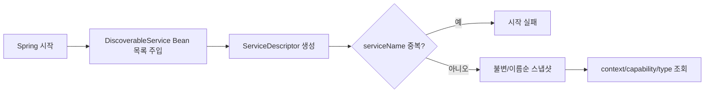
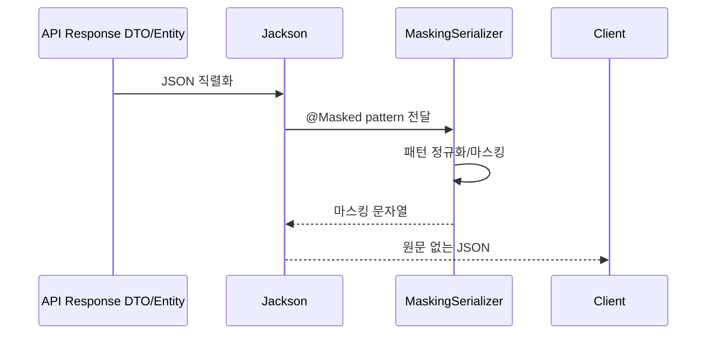

# Shared-Kernel 업무 및 데이터 흐름

## 1. 로컬 capability 레지스트리



메서드 순서:

1. 생성자에서 Bean 목록을 불변 복사합니다.
2. 각 Bean의 `descriptor()`를 한 번 호출합니다.
3. 서비스 이름으로 정렬합니다.
4. 중복 이름을 검증합니다.
5. 조회 메서드는 저장된 스냅샷을 함수형 filter/map으로 반환합니다.

이 구조는 `ApplicationContext.getBeansOfType()`를 업무 호출마다 실행하는 서비스 로케이터보다
의존성이 명확하고 결과 순서가 결정적입니다.

## 2. Source Document 조회와의 연결

```text
Journal SourceDocumentService
  -> ServiceDiscoveryRegistry.findByCapability(SOURCE_DOCUMENT_LOOKUP)
  -> SourceDocumentProvider 목록
  -> supports(lineageSourceType)
  -> getSourceDocument(type, id)
```

모두 같은 Spring 프로세스 안의 호출입니다. 원격 서비스로 분리되면 contracts 포트를 구현하는
REST/Feign 어댑터가 필요합니다.

## 3. JSON 마스킹



미지원 패턴과 너무 짧아 안전한 앞/뒤 노출 범위를 만들 수 없는 값은 전체 마스킹합니다.
마스킹은 JSON 출력 어댑터 정책이며 도메인 값 자체를 변경하지 않습니다.

## 4. ECL 이벤트의 현재 흐름과 TODO

```text
account-mart CdmEventPublisher
  -> CdmDataReadyEvent
  -> Kafka allowance-cdm-events
  -> ECL CdmDataReadyConsumer
  -> Spring Batch JobLauncher
```

현재 이벤트는 shared-kernel에 있지만 두 컨텍스트 전용 통합 계약입니다. `eventId`를 Spring Batch
JobInstance 멱등 키로 사용하도록 보강했지만 `schemaVersion`, producer와 실제 분산락은 없습니다.
운영 전 전용 계약 모듈과 명시적 락 포트, 동일 기준일 재실행 정책으로 분리해야 합니다.