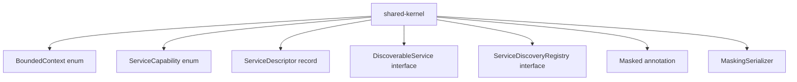

# Shared-Kernel Schema

## 1. 포함 타입

## 2. `BoundedContext`

값:
- `MASTER_DATA`
- `GOVERNANCE`
- `JOURNAL_LEDGER`
- `RECEIVABLE`
- `PAYABLE`
- `ASSET_LEASE`
- `LOAN`
- `CLOSING`
- `RECONCILIATION`
- `REPORTING`
- `TAX`
- `EXPENDITURE_RESOLUTION`

의미:
- 서비스나 모듈이 어느 업무 경계에 속하는지 표현하는 enum입니다.

## 3. `ServiceCapability`

값:
- `SOURCE_DOCUMENT_LOOKUP`
- `MASTER_DATA_QUERY`
- `JOURNAL_POSTING`
- `ACCOUNTING_PERIOD_STATUS`
- `BUDGET_CONTROL`
- `ASSET_REGISTRATION`
- `LEASE_PAYMENT_RESOLUTION`
- `TAX_INVOICE_QUERY`

의미:
- 서비스가 외부에 제공하는 계약 기능을 표현하는 enum입니다.

## 4. `ServiceDescriptor`

필드:
- `serviceName`
- `context`
- `capabilities`
- `description`

의미:
- 서비스 메타정보와 capability 집합을 한 번에 표현하는 record입니다.

## 5. `DiscoverableService`

핵심 메서드:
- `descriptor()`

의미:
- 런타임 레지스트리에 등록될 수 있는 서비스의 최소 계약입니다.

## 6. `ServiceDiscoveryRegistry`

핵심 메서드:
- `getServiceDescriptors()`
- `findDescriptor(...)`
- `findByContext(...)`
- `findByCapability(...)`
- `getServices(...)`

의미:
- discoverable service를 capability/컨텍스트 기준으로 찾는 공통 레지스트리 계약입니다.

## 7. `Masked`

속성:
- `pattern`

기본값:
- `DEFAULT`

적용 대상:
- `FIELD`
- `METHOD`

의미:
- 민감정보 필드에 어떤 마스킹 규칙을 쓸지 표시하는 어노테이션입니다.

## 8. `MaskingSerializer`

역할:
- `JsonSerializer<String>`
- `ContextualSerializer`

핵심 메서드:
- `serialize(...)`
- `createContextual(...)`

지원 규칙:
- `REG_NO`
- `ACCOUNT`
- `EMAIL`
- 기본 마스킹

## 9. 읽을 때 중요한 점

- 이 모듈은 DB 스키마가 아니라 코드 레벨 공통 계약 모음입니다.
- 실제 마스킹 동작 여부는 사용하는 쪽의 Jackson 직렬화 설정과 필드 어노테이션에 달려 있습니다.
