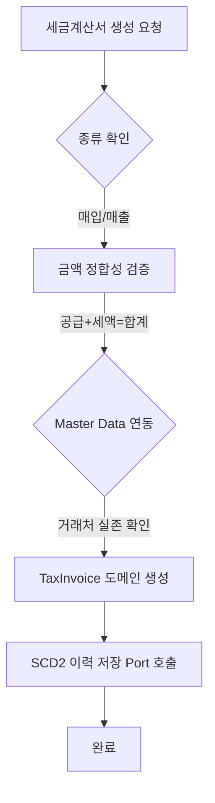
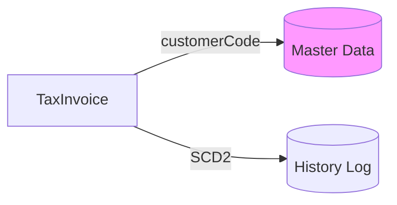
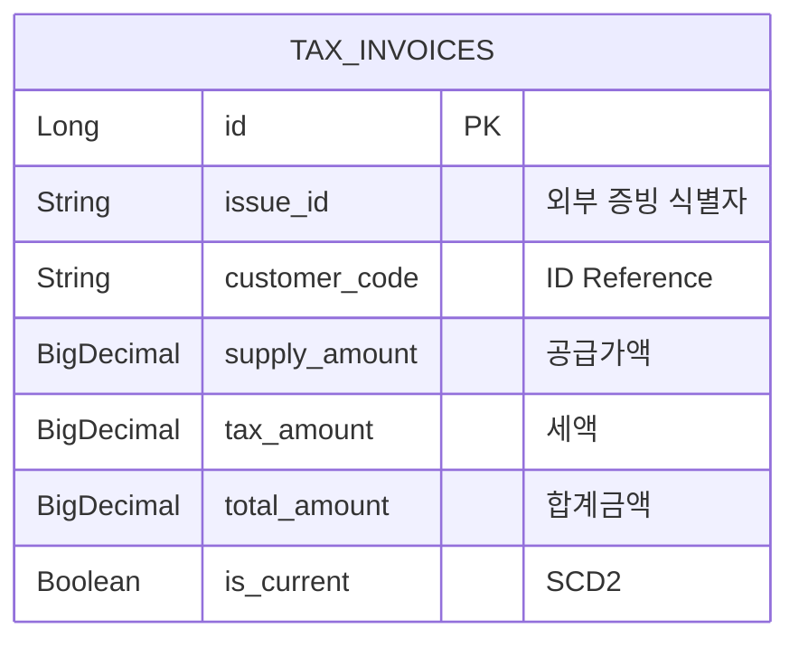

# 🧾 Tax Service (세무 및 세금계산서 관리)

`tax` 모듈은 회사의 공식 증빙인 세금계산서(VAT Invoice)를 관리하고, 국세청 신고 및 매입/매출 전표와의 정합성을 보장하는 모듈입니다.

---

## 1. 🐣 초보자를 위한 개념 설명 (Beginner Guide)

**세금계산서는 회사의 '공식 영수증'입니다.**
우리가 식당에서 밥을 먹고 영수증을 받아야 비용 처리를 할 수 있듯이, 회사도 다른 회사와 거래할 때 반드시 '세금계산서'라는 공식 문서를 주고받아야 합니다.
1. **공급가액 (Supply):** 순수한 물건 가격 (예: 10,000원)
2. **세액 (VAT):** 나라에 내는 부가가치세 (예: 1,000원)
3. **합계금액 (Total):** 최종 결제 금액 (예: 11,000원)

이 모듈은 이 공식(공급가액 + 세액 = 합계)이 1원이라도 틀리지 않는지 철저히 감시하는 문지기 역할을 합니다.

---

## 2. 🔄 프로세스 흐름 (Process Flow)

### 📌 세금계산서 발행 및 검증 흐름
외부 요청부터 금액 검증, SCD2 이력 저장까지의 헥사고날 아키텍처 흐름입니다.



### 📌 아키텍처 원칙: ID 기반 참조 및 이력 보존
모든 거래처 정보는 **String ID**로 관리하며, 증빙의 수정 이력을 **SCD2** 방식으로 완벽히 보존합니다.



---

## 3. 📊 데이터 모델 (Schema)

세금계산서의 무결성과 이력 추적을 위한 테이블 구조입니다.



---

## 4. 🐳 실행 및 연동 방법

**실행 명령:**
```bash
docker-compose up -d tax
```

**연동 주의사항:**
- 세금계산서는 회계 전표(`journal-ledger`)와 긴밀히 연동되어야 합니다.
- 금액 검증 실패 시 전표 생성이 차단되므로 도메인 내 `validateAmounts()` 로직을 반드시 확인하세요.
