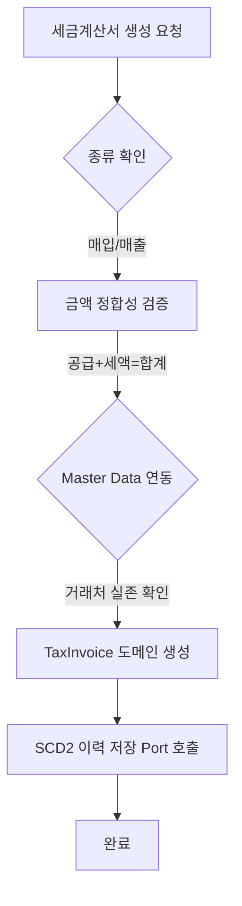
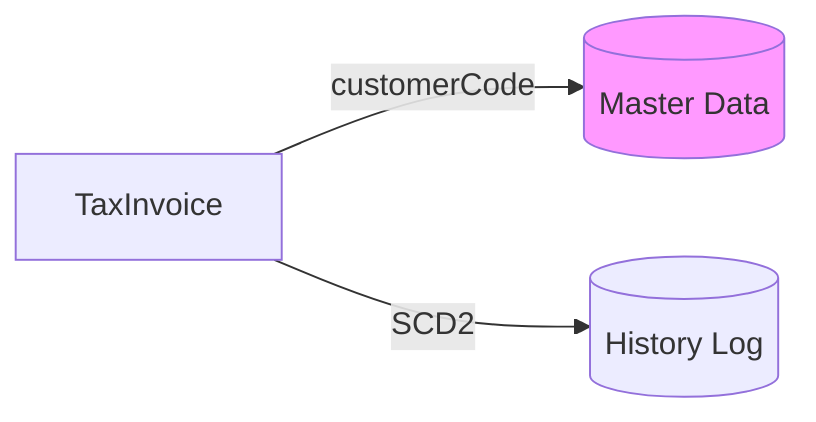
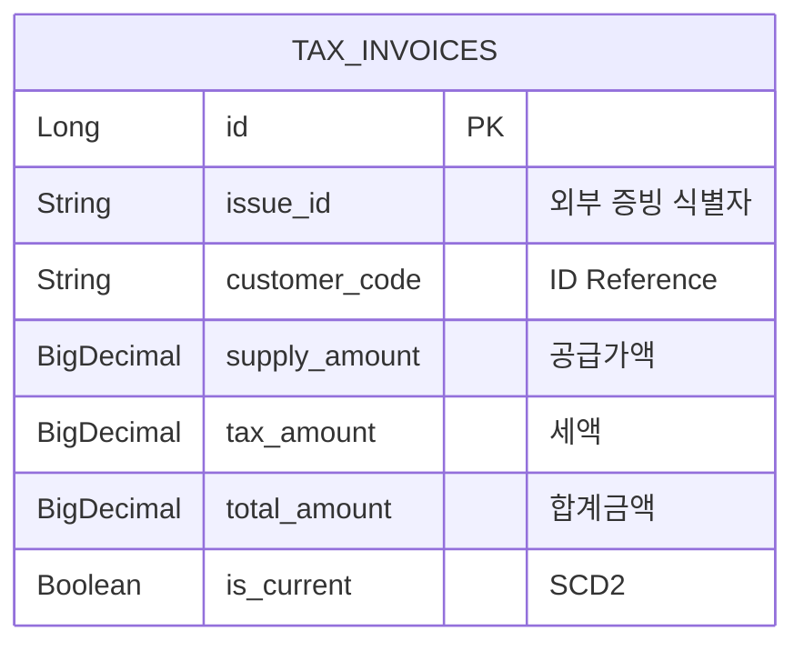

# 🧾 Tax Service (세무 및 세금계산서 관리)

`tax` 모듈은 회사의 공식 증빙인 세금계산서(VAT Invoice)를 관리하고, 국세청 신고 및 매입/매출 전표와의 정합성을 보장하는 모듈입니다.

상세 문서는 [tax/docs/README.md](./docs/README.md)에서 순서대로 읽을 수 있습니다. 기존 문서 인덱스는 삭제하지 않고 `tax/docs/archive`에 보존했습니다.

---

## 1. 🐣 초보자를 위한 개념 설명 (Beginner Guide)

**세금계산서는 회사의 '공식 영수증'입니다.**
우리가 식당에서 밥을 먹고 영수증을 받아야 비용 처리를 할 수 있듯이, 회사도 다른 회사와 거래할 때 반드시 '세금계산서'라는 공식 문서를 주고받아야 합니다.
1. **공급가액 (Supply):** 순수한 물건 가격 (예: 10,000원)
2. **세액 (VAT):** 나라에 내는 부가가치세 (예: 1,000원)
3. **합계금액 (Total):** 최종 결제 금액 (예: 11,000원)

이 모듈은 이 공식(공급가액 + 세액 = 합계)이 1원이라도 틀리지 않는지 철저히 감시하는 문지기 역할을 합니다.

---

## 2. 🔄 프로세스 흐름 (Process Flow)

### 📌 세금계산서 발행 및 검증 흐름
외부 요청부터 금액 검증, SCD2 이력 저장까지의 헥사고날 아키텍처 흐름입니다.



### 📌 아키텍처 원칙: ID 기반 참조 및 이력 보존
모든 거래처 정보는 **String ID**로 관리하며, 증빙의 수정 이력을 **SCD2** 방식으로 완벽히 보존합니다.



---

## 3. 📊 데이터 모델 (Schema)

세금계산서의 무결성과 이력 추적을 위한 테이블 구조입니다.



---

## 4. 로컬 실행 및 연동 방법

`tax`는 현재 독립 Spring Boot 앱이 아니라 `java-library` 모듈입니다. 별도 `SpringBootApplication`과 `:tax:bootRun` 태스크가 없으므로 IntelliJ에서는 Gradle 테스트 실행 구성을 사용합니다.

**PowerShell 검증 명령:**

```powershell
.\gradlew :tax:test --console=plain --max-workers=1 --no-daemon
```

**빠른 컴파일 확인:**

```powershell
.\gradlew :tax:compileJava --console=plain --max-workers=1 --no-daemon
```

**IntelliJ 실행 순서:**
1. 루트 프로젝트를 Gradle 프로젝트로 엽니다.
2. Project SDK와 Gradle JVM을 JDK 17로 맞춥니다.
3. 상단 Run Configuration에서 `Tax Module Tests`를 선택해 실행합니다.
4. 실제 HTTP API를 호출하려면 tax 컴포넌트를 스캔하는 호스트 Spring Boot 앱이 필요합니다.

**연동 주의사항:**
- 세금계산서는 회계 전표(`journal-ledger`)와 긴밀히 연동되어야 합니다.
- 금액 검증 실패 시 전표 생성이 차단되므로 도메인 내 `validateAmounts()` 로직을 반드시 확인하세요.
- 거래처 검증은 `contracts`의 `MasterDataQueryPort`를 사용하며 master-data 내부 저장소에 직접 의존하지 않습니다.
- 발행된 세금계산서는 물리 삭제하지 않습니다. 취소 처리자와 사유를 받아 `CANCELLED` 상태로 전환해 증빙 감사 이력을 보존합니다.
- 현재 웹 API는 `/api/ap/invoices` 매입 세금계산서(`PURCHASE`) 중심입니다. 매출 세금계산서 API는 별도 확장이 필요합니다.

## 5. 문서 읽기 순서

- [docs/beginner-guide.md](./docs/beginner-guide.md): 세금계산서와 금액 검증 개념.
- [docs/process-flow.md](./docs/process-flow.md): AP Invoice 생성, 수정, 취소, 외부 조회 포트 흐름.
- [docs/schema.md](./docs/schema.md): 테이블, 상태, 논리 취소 필드.
- [docs/local-run.md](./docs/local-run.md): IntelliJ와 Gradle 로컬 검증 방법.
