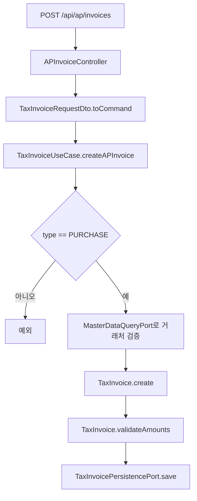

# tax process flow

## API 입구

현재 `tax`는 `core/api/batch` 구조다. 아래 API는 `tax:api` Spring Boot 애플리케이션에서 노출되고, 실제 세무 검증과 상태 변경은 `tax:core`가 처리한다. HTTP 요청 DTO는 API 모듈에 있고, core는 `TaxInvoiceCommand`라는 업무 명령만 받는다.

| 컨트롤러 | 메서드 | 경로 | 역할 |
| --- | --- | --- | --- |
| `APInvoiceController` | `POST` | `/api/ap/invoices` | 매입 세금계산서를 생성한다. |
| `APInvoiceController` | `GET` | `/api/ap/invoices/{id}` | ID로 매입 세금계산서를 조회한다. |
| `APInvoiceController` | `GET` | `/api/ap/invoices/issue-id/{issueId}` | 승인번호로 매입 세금계산서를 조회한다. |
| `APInvoiceController` | `GET` | `/api/ap/invoices?startDate=2026-06-01&endDate=2026-06-30` | 작성일 기간으로 매입 세금계산서를 조회한다. |
| `APInvoiceController` | `PUT` | `/api/ap/invoices/{id}` | 매입 세금계산서 정보를 수정한다. |
| `APInvoiceController` | `DELETE` | `/api/ap/invoices/{id}?reason=...` | 물리 삭제 대신 취소 상태로 전환한다. |

취소 API는 `X-User-ID` 헤더가 필요하다.

## 생성 흐름



핵심 정합성 포인트:

- `type`은 `PURCHASE`만 허용한다.
- 거래처 코드는 master-data의 `MasterDataQueryPort`로 확인한다.
- 공급가액 + 세액 = 합계금액이어야 한다.
- `issueId`는 DB에서 unique 값이다.

## 수정 흐름

```mermaid
flowchart TD
    A[PUT /api/ap/invoices/{id}] --> B[기존 세금계산서 조회]
    B --> C{기존 타입과 요청 타입이 PURCHASE인가}
    C -->|아니오| D[예외]
    C -->|예| E[거래처 검증]
    E --> F[TaxInvoice.updateInfo]
    F --> G[TaxInvoice.validateAmounts]
    G --> H[저장]
```

수정도 생성과 같은 금액 검증을 통과해야 한다. 세금계산서는 증빙이므로 승인번호, 작성일, 거래처, 금액 변경이 모두 감사 대상이다. 현재 별도 이력 테이블은 없고 최신 상태만 엔티티에 저장된다.

## 취소 흐름

```mermaid
flowchart TD
    A[DELETE /api/ap/invoices/{id}] --> B[X-User-ID와 reason 수신]
    B --> C[TaxInvoiceService.cancelAPInvoice]
    C --> D[세금계산서 조회]
    D --> E{PURCHASE 타입인가}
    E -->|아니오| F[예외]
    E -->|예| G[TaxInvoice.cancel]
    G --> H[CANCELLED, cancelledBy, reason, cancelledAt 저장]
```

`TaxInvoice.cancel`은 이미 취소된 증빙을 다시 취소하지 못하게 막고, 취소 실행자와 사유가 비어 있으면 예외를 던진다.

## 외부 조회 포트

`TaxInvoiceQueryAdapter`는 `contracts`의 `TaxInvoiceQueryPort`를 구현한다. 다른 모듈은 tax 내부 Repository가 아니라 이 계약을 통해 `TaxInvoiceRef`를 얻어야 한다.

`TaxInvoiceRef`는 `id`, `issueId`, `type`, `status`를 반환한다. 또한 `purchase()`, `active()`, `usableForPurchaseSettlement()` 편의 메서드를 제공한다. 정책은 "감사용 조회는 가능하지만 소비 모듈이 `PURCHASE + ACTIVE`만 업무 연결에 사용"하는 방식이다.

초보자 관점에서는 취소 세금계산서를 영수증 보관함에서 없애지는 않지만, 새 지출결의나 AP 지급에는 붙이지 못하게 막는다고 이해하면 된다. `expenditure-resolution`은 `TaxInvoiceRef.purchase()`와 `active()` 기준으로 `PURCHASE` 타입이면서 `ACTIVE` 상태인 세금계산서만 연결한다.

## Batch 실행 경계

`tax:batch`의 `TaxInvoiceValidationBatchConfig`는 Job/Step/Tasklet 실행 흐름만 정의한다. 기간 파라미터를 읽은 뒤 core `TaxInvoiceBatchUseCase.validatePurchaseInvoices`에 위임하므로, 금액 검증과 거래처 참조 검증은 batch가 아니라 core 업무 서비스에 남아 있다.

`TaxBatchJobRegistryConfiguration`은 Spring Batch Job 등록 시점을 늦춰 로컬 context 기동 시 `jobRegistryBeanPostProcessor` 조기 초기화 경고를 제거한다. 이 설정은 순수 인프라 설정이며 세금계산서 업무 규칙을 포함하지 않는다.