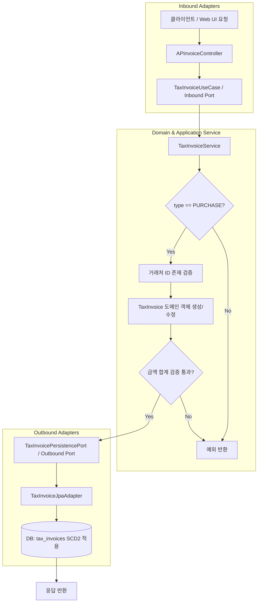

# Tax Process Flow

## 1. 이 모듈이 하는 일

`tax`는 매입 세금계산서를 관리하고, 타 모듈이 세금계산서 타입/식별 정보를 조회할 수 있도록 계약 기반 데이터를 제공합니다.

- 매입 세금계산서 CRUD 및 이력 관리(SCD2)
- 금액 정합성 검증 (`supply + tax = total`)
- 매입 타입(`PURCHASE`) 경계 강제
- 다단계 도커(Multi-stage Docker) 배포 환경에서의 안정적인 런타임 제공

## 2. AP 세금계산서 처리 흐름 (헥사고날 아키텍처 기반)

## 3. 핵심 처리 원칙

### 3.1 헥사고날 포트/어댑터 통제
- **Inbound Port:** 모든 비즈니스 유즈케이스는 인터페이스(Port)로 정의되어 Controller와 도메인을 분리합니다.
- **Outbound Port:** DB 접근이나 외부 MSA(마스터 데이터) 호출은 영속성 포트와 외부 연동 포트를 통해서만 이루어집니다.

### 3.2 ID 기반 참조 (ID-based references)
- 외부 모듈과의 모든 데이터 결합은 `business_partner_code`와 같은 문자열이 아닌 불변의 고유 식별자인 `business_partner_id`를 사용합니다.

### 3.3 SCD2 이력 관리
- 데이터 수정(Update) 시, 물리적인 덮어쓰기(Overwrite)를 방지하고, 이전 레코드의 `valid_to`를 업데이트한 후 새로운 레코드를 `is_current = true` 상태로 Insert하여 완벽한 감사 추적(Audit Trail)을 보장합니다.

### 3.4 Multi-stage Docker 운영
- 배포 시, 소스 코드를 빌드하는 Builder 이미지와 실행 환경만 담은 Runtime 이미지로 분리되어 구동되며, 환경 변수 주입을 통해 컨테이너 시작 시 동적으로 DB 및 카프카 연결을 설정합니다.