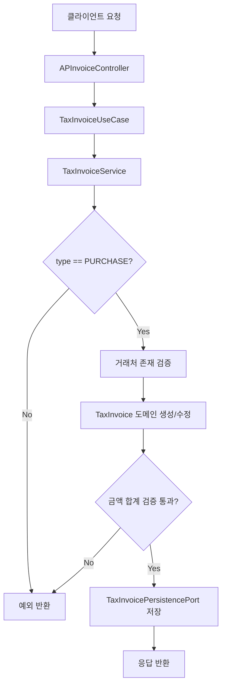

# tax process flow

## 1. 이 모듈이 하는 일

`tax`는 매입 세금계산서를 관리하고, 타 모듈이 세금계산서 타입/식별 정보를 조회할 수 있도록 계약 기반 데이터를 제공합니다.

핵심 책임:

- 매입 세금계산서 CRUD
- 금액 정합성 검증 (`supply + tax = total`)
- 매입 타입(`PURCHASE`) 경계 강제
- 기간 조회 및 증빙 식별자(`issueId`) 조회

## 2. AP 세금계산서 처리 흐름

## 3. API별 내부 동작

### 3.1 생성 (`POST /api/ap/invoices`)

- 컨트롤러: `APInvoiceController.createAPInvoice`
- 서비스: `TaxInvoiceService.createAPInvoice`
- 규칙:
  - `requestDto.type`이 반드시 `PURCHASE`
  - 거래처 코드가 존재해야 함
  - 금액 합계 검증 통과 후 저장

### 3.2 조회 (`GET`)

- `getAPInvoiceById`
- `getAPInvoiceByIssueId`
- `getAPInvoicesBetweenDates`

조회 시에도 서비스에서 `isPurchaseType()` 필터를 적용합니다.

### 3.3 수정/삭제 (`PUT`, `DELETE`)

- 수정/삭제 대상이 실제로 존재해야 함
- 기존 데이터와 요청 데이터 모두 `PURCHASE` 경계를 만족해야 함
- 수정 시 `TaxInvoice.updateInfo(...)`로 금액 재검증 수행

## 4. 다른 모듈과의 연계 포인트

- `expenditure-resolution`의 서비스는 `contracts`의 `TaxInvoiceQueryPort`를 통해 세금계산서를 조회합니다.
- 조회 결과는 `TaxInvoiceRef(id, issueId, type)` 형태의 경량 참조 모델입니다.
- 업무 규칙은 동일합니다: `type == PURCHASE`일 때만 매입 증빙으로 인정됩니다.

## 5. 구현 점검 포인트 (리팩터링 진행 구간)

현재 소스 기준으로 `TaxInvoiceUseCase`/`TaxInvoicePersistencePort`는 분리되어 있으며,
타 모듈 조회 계약(`TaxInvoiceQueryPort`)은 `contracts`에 정의되어 있습니다.

초보자는 아래를 함께 확인해야 합니다.

- 포트 인터페이스와 실제 빈 구성의 연결 여부
- 모듈 통합 시 조회 어댑터 구현 위치
- 컨트롤러가 애플리케이션 포트에만 의존하는지 여부

## 6. 초보자가 꼭 기억할 포인트

- AP API는 매입 전용이므로 `PURCHASE` 경계가 핵심입니다.
- 금액 검증 실패는 단순 입력오류가 아니라 회계 증빙 오류입니다.
- 헥사고날 관점에서 컨트롤러는 유즈케이스만 호출하고, 외부 시스템/영속성 세부는 포트 뒤로 숨겨야 합니다.
