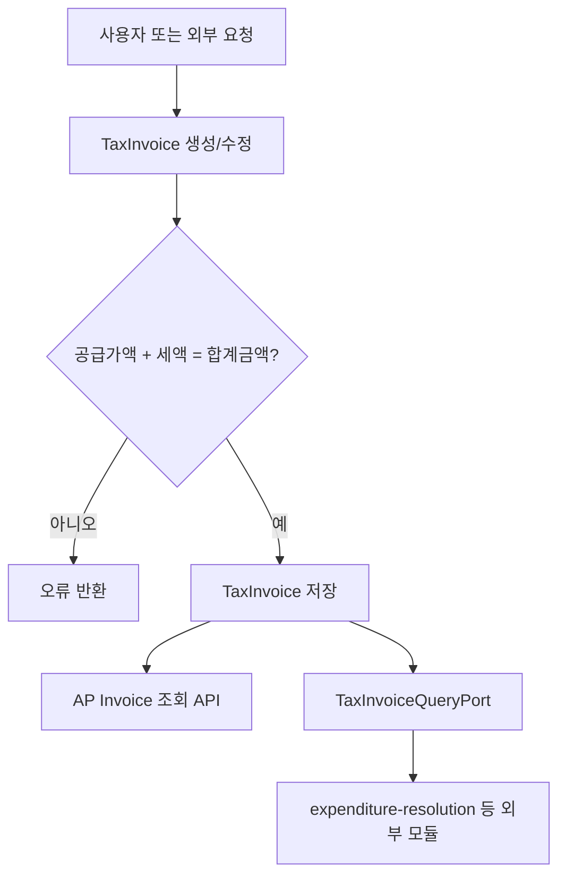
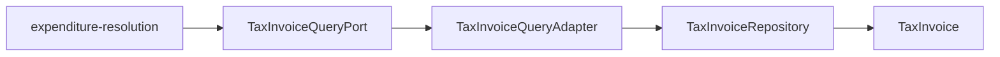

# tax process flow

## 1. 이 모듈이 하는 일

`tax` 모듈은 세금계산서를 저장하고, 다른 모듈이 "이 세금계산서가 매입용인지"를 확인할 수 있게 한다.

핵심 책임:

- 세금계산서 금액 검증
- 매입 세금계산서 CRUD
- 기간별 세금계산서 조회
- `TaxInvoiceQueryPort` 제공

## 2. 전체 흐름도

## 3. 매입 세금계산서 흐름

### 3.1 생성

- 진입점: `POST /api/ap/invoices`
- 서비스: `APInvoiceService.createAPInvoice`
- 처리:
  - 타입이 `PURCHASE`인지 확인
  - 거래처 조회
  - 공급가액 + 세액 = 합계금액 검증
  - 저장

### 3.2 조회

- `GET /api/ap/invoices/{id}`
- `GET /api/ap/invoices/issue-id/{issueId}`
- `GET /api/ap/invoices?startDate=...&endDate=...`

조회 특징:

- `APInvoiceService`는 `PURCHASE` 타입만 필터링한다

### 3.3 수정/삭제

- 수정: `PUT /api/ap/invoices/{id}`
- 삭제: `DELETE /api/ap/invoices/{id}`

제약:

- 수정/삭제 대상도 `PURCHASE` 타입이어야 한다

## 4. 다른 모듈과의 연계

설명:

- `expenditure-resolution`은 세금계산서 ID를 받아 이 포트를 통해 조회한다
- 반환 정보는 `TaxInvoiceRef(id, issueId, type)` 수준의 경량 참조다
- 지출결의와 AP 지급은 이 값을 보고 `PURCHASE` 타입인지 검사한다

## 5. 초보자가 꼭 기억할 포인트

- 이 모듈의 핵심 규칙은 금액 합계 검증과 매입/매출 타입 구분이다.
- 현재 공개 API는 사실상 매입 세금계산서 중심이다.
- 다른 모듈은 세부 엔티티 대신 계약 포트로 조회하도록 분리되고 있다.
