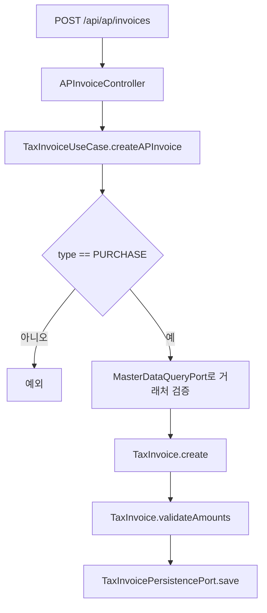

# tax process flow

## API 입구

현재 `tax`는 library 모듈이므로 아래 API는 tax 컴포넌트를 포함하는 호스트 Spring Boot 애플리케이션에서 노출될 때 사용할 수 있다.

| 컨트롤러 | 메서드 | 경로 | 역할 |
| --- | --- | --- | --- |
| `APInvoiceController` | `POST` | `/api/ap/invoices` | 매입 세금계산서를 생성한다. |
| `APInvoiceController` | `GET` | `/api/ap/invoices/{id}` | ID로 매입 세금계산서를 조회한다. |
| `APInvoiceController` | `GET` | `/api/ap/invoices/issue-id/{issueId}` | 승인번호로 매입 세금계산서를 조회한다. |
| `APInvoiceController` | `GET` | `/api/ap/invoices?startDate=2026-06-01&endDate=2026-06-30` | 작성일 기간으로 매입 세금계산서를 조회한다. |
| `APInvoiceController` | `PUT` | `/api/ap/invoices/{id}` | 매입 세금계산서 정보를 수정한다. |
| `APInvoiceController` | `DELETE` | `/api/ap/invoices/{id}?reason=...` | 물리 삭제 대신 취소 상태로 전환한다. |

취소 API는 `X-User-ID` 헤더가 필요하다.

## 생성 흐름



핵심 정합성 포인트:

- `type`은 `PURCHASE`만 허용한다.
- 거래처 코드는 master-data의 `MasterDataQueryPort`로 확인한다.
- 공급가액 + 세액 = 합계금액이어야 한다.
- `issueId`는 DB에서 unique 값이다.

## 수정 흐름

```mermaid
flowchart TD
    A[PUT /api/ap/invoices/{id}] --> B[기존 세금계산서 조회]
    B --> C{기존 타입과 요청 타입이 PURCHASE인가}
    C -->|아니오| D[예외]
    C -->|예| E[거래처 검증]
    E --> F[TaxInvoice.updateInfo]
    F --> G[TaxInvoice.validateAmounts]
    G --> H[저장]
```

수정도 생성과 같은 금액 검증을 통과해야 한다. 세금계산서는 증빙이므로 승인번호, 작성일, 거래처, 금액 변경이 모두 감사 대상이다. 현재 별도 이력 테이블은 없고 최신 상태만 엔티티에 저장된다.

## 취소 흐름

```mermaid
flowchart TD
    A[DELETE /api/ap/invoices/{id}] --> B[X-User-ID와 reason 수신]
    B --> C[TaxInvoiceService.cancelAPInvoice]
    C --> D[세금계산서 조회]
    D --> E{PURCHASE 타입인가}
    E -->|아니오| F[예외]
    E -->|예| G[TaxInvoice.cancel]
    G --> H[CANCELLED, cancelledBy, reason, cancelledAt 저장]
```

`TaxInvoice.cancel`은 이미 취소된 증빙을 다시 취소하지 못하게 막고, 취소 실행자와 사유가 비어 있으면 예외를 던진다.

## 외부 조회 포트

`TaxInvoiceQueryAdapter`는 `contracts`의 `TaxInvoiceQueryPort`를 구현한다. 다른 모듈은 tax 내부 Repository가 아니라 이 계약을 통해 `TaxInvoiceRef`를 얻어야 한다.

현재 `TaxInvoiceRef`에는 상태가 없어 취소된 증빙을 외부 모듈에서 어떻게 다룰지 판단하기 어렵다. 코드에 `@todo`로 남긴 것처럼 상태 포함 또는 취소 건 제외 정책을 확정해야 한다.
