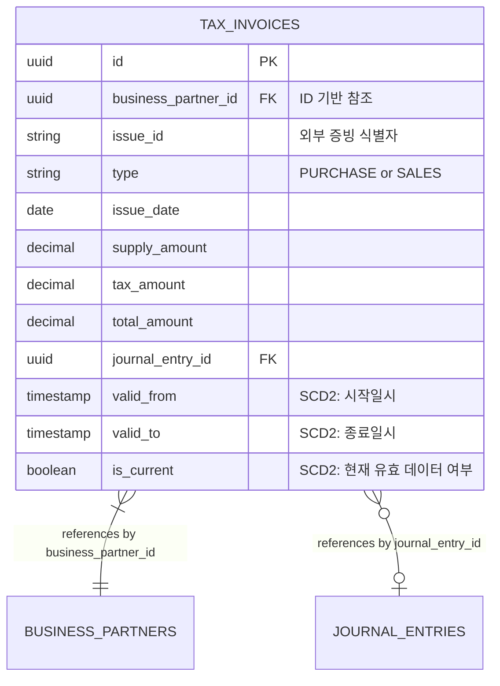
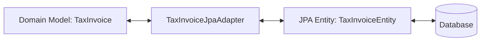

# Tax Schema

## 1. 헥사고날 및 SCD2 기반 엔티티 구조

## 2. 핵심 엔티티: `tax_invoices` (SCD2 적용)

세금계산서의 생성 및 변경 이력을 모두 저장하는 테이블입니다.

주요 컬럼:
- `id`: 내부 식별자 (PK)
- `issue_id`: 외부 국세청/발행처 증빙 식별자
- `type`: `SALES` 또는 `PURCHASE`
- `business_partner_id`: 거래처 고유 식별자 (ID 기반 참조)
- `supply_amount` / `tax_amount` / `total_amount`: 검증된 정합성 금액 (`BigDecimal`)
- **[SCD2 컬럼]** `valid_from`: 레코드 유효 시작 시간
- **[SCD2 컬럼]** `valid_to`: 레코드 유효 종료 시간 (현재 유효하면 NULL 또는 최대치)
- **[SCD2 컬럼]** `is_current`: 최신 유효 레코드 여부 플래그

## 3. 헥사고날 구조 내 데이터 변환 흐름

- 도메인 객체(`TaxInvoice`)는 순수한 Java 클래스이며 JPA나 프레임워크 어노테이션에 의존하지 않습니다.
- DB에 저장될 때는 `Outbound Adapter`에서 도메인 객체를 JPA Entity(`TaxInvoiceEntity`)로 변환하며, 이때 식별자 매핑 및 SCD2 이력 처리 로직이 캡슐화되어 동작합니다.