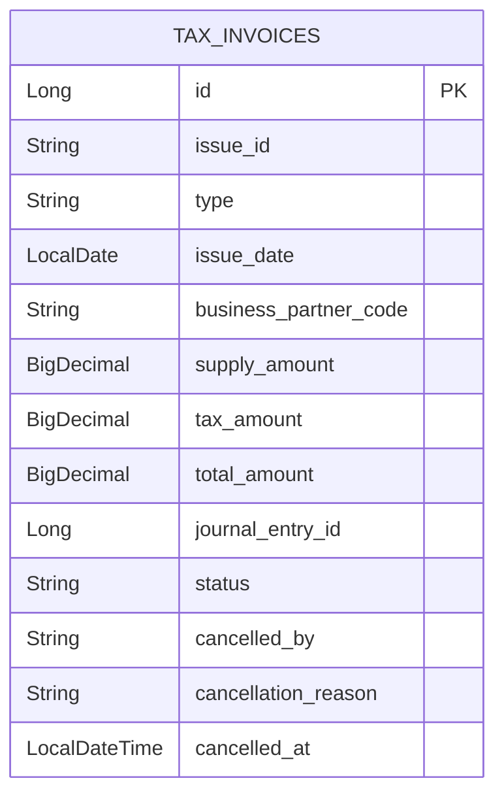

# tax schema

## 핵심 ERD



## 필드 설명

| 필드 | 의미 |
| --- | --- |
| `issueId` | 국세청 또는 외부 시스템의 세금계산서 승인번호. unique 값이다. |
| `type` | `SALES` 또는 `PURCHASE`. 현재 AP API는 `PURCHASE`만 허용한다. |
| `issueDate` | 세금계산서 작성일자. |
| `businessPartnerCode` | 거래처 코드. master-data 엔티티 직접 참조가 아니라 코드 참조다. |
| `supplyAmount` | 공급가액. |
| `taxAmount` | 부가가치세. |
| `totalAmount` | 공급가액과 세액의 합계. |
| `journalEntryId` | 전표 연결 확장 지점. 현재 AP 생성 흐름에서는 직접 전표를 생성하지 않는다. |
| `status` | `ACTIVE` 또는 `CANCELLED`. |
| `cancelledBy`, `cancellationReason`, `cancelledAt` | 논리 취소 감사 정보. |

## 상태

| 상태 | 의미 |
| --- | --- |
| `ACTIVE` | 유효한 세금계산서 |
| `CANCELLED` | 취소 처리된 세금계산서. 물리 삭제하지 않는다. |

## 도메인 검증

`TaxInvoice.validateAmounts()`는 다음 조건을 검증한다.

```text
supplyAmount + taxAmount == totalAmount
```

금액이 하나라도 `null`이면 예외가 발생하고, 합계가 맞지 않아도 예외가 발생한다. 요청 DTO에서는 금액이 0 이상인지 먼저 검증하고, 도메인에서는 세 금액의 관계를 검증한다.

## 외부 참조 정책

- `MasterDataQueryPort`: 생성과 수정 시 거래처 코드 존재 여부를 확인한다.
- `TaxInvoiceQueryPort`: 다른 모듈이 세금계산서 참조를 조회할 때 사용한다.
- `JournalEntryId`: 전표 연결 확장 필드지만 현재 세금계산서 생성 시 전표 생성까지 수행하지 않는다.

외부 조회 포트는 취소 세금계산서도 반환하되 `TaxInvoiceRef.status`에 `ACTIVE` 또는 `CANCELLED`를 함께 담는다. `TaxInvoiceRef`는 `purchase()`, `active()`, `usableForPurchaseSettlement()`를 제공하므로 소비 모듈은 tax 내부 enum을 몰라도 업무 연결 가능 여부를 결정할 수 있다. 이렇게 하면 감사 추적용 조회는 가능하고, 소비 모듈은 상태를 보고 업무 연결 여부를 결정할 수 있다.

현재 소비 정책은 fail-closed다. `expenditure-resolution`의 지출결의와 AP 지급은 `PURCHASE` 타입이면서 `ACTIVE` 상태인 세금계산서만 연결하고, `CANCELLED` 상태는 예외로 차단한다.

## PostgreSQL 기준선

전용 Flyway V1은 PostgreSQL 15+에서 `tax_invoices`를 생성하고 `numeric(19,2)` 금액 합계, type, ACTIVE/CANCELLED 감사 상태, issue ID unique와 기간·거래처 조회 인덱스를 보호한다. history 없는 비어 있지 않은 DB에는 자동 baseline하지 않는다.
