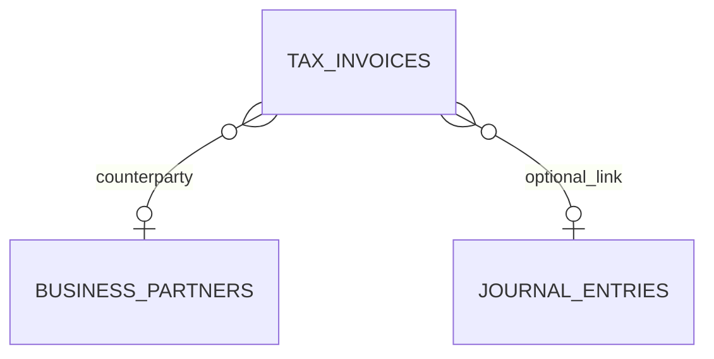

# tax schema

## 1. 한눈에 보는 구조

## 2. 핵심 엔티티

### 2.1 `tax_invoices`

세금계산서 엔티티다.

주요 컬럼:

- `id`
- `issue_id`
- `type`
- `issue_date`
- `business_partner_code`
- `supply_amount`
- `tax_amount`
- `total_amount`
- `journal_entry_id`

핵심 의미:

- `type`
  - `SALES`
  - `PURCHASE`
- `journal_entry_id`
  - 선택 연결
  - 세금계산서와 연계된 회계 전표가 있을 경우 사용

## 3. 데이터 흐름 관점

## 4. 초보자용 해석

- `TaxInvoice`는 세금 증빙의 저장 단위다.
- `issueId`는 외부 증빙 식별자 역할을 한다.
- `type`이 매우 중요하다.
- 지출 모듈은 이 값이 `PURCHASE`인지 확인해 매입 증빙으로 인정한다.
