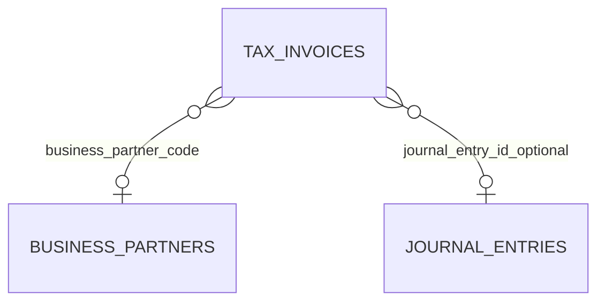
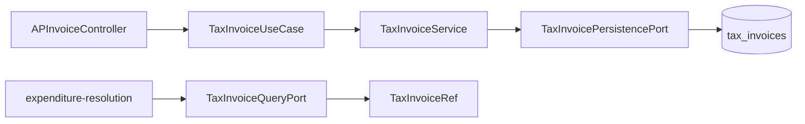

# tax schema

## 1. 한눈에 보는 구조

## 2. 핵심 엔티티: `tax_invoices`

세금계산서 1건을 저장하는 테이블입니다.

주요 컬럼:

- `id`: 내부 식별자
- `issue_id`: 외부 증빙 식별자(유니크)
- `type`: `SALES` 또는 `PURCHASE`
- `issue_date`: 발행일
- `business_partner_code`: 거래처 코드(FK)
- `supply_amount`: 공급가액 (`BigDecimal`)
- `tax_amount`: 세액 (`BigDecimal`)
- `total_amount`: 합계금액 (`BigDecimal`)
- `journal_entry_id`: 전표 연결(선택)

## 3. 도메인 규칙 매핑

`TaxInvoice` 도메인에서 다음 규칙을 강제합니다.

- `supply_amount + tax_amount == total_amount`
- AP 흐름에서는 `type == PURCHASE`

즉, 스키마는 데이터를 담고, 정합성은 도메인 + 서비스가 함께 지킵니다.

## 4. 데이터 흐름 관점

## 5. 초보자용 해석

- `issue_id`는 업무팀이 증빙을 추적할 때 가장 자주 보는 키입니다.
- `type`은 단순 분류값이 아니라 업무 경계값입니다.
- 금액 3종(`supply/tax/total`)은 회계 계산의 최소 검증 세트입니다.
- `journal_entry_id`는 필요할 때만 연결되는 선택 관계입니다.
